# FinTrack - Hướng Dẫn Sử Dụng

## Tổng Quan

FinTrack là một ứng dụng quản lý tài chính cá nhân được xây dựng với kiến trúc Client-Server:
- **Frontend**: React + Vite với Ant Design và Tailwind CSS
- **Backend**: ASP.NET Core Web API với Entity Framework Core
- **Database**: SQL Server
- **Authentication**: JWT Token với HTTP-only cookies

## Các Chức Năng Chính

### 1. 🔐 Xác Thực Người Dùng (Authentication)
- **Đăng ký tài khoản**: Tạo tài khoản mới với email, mật khẩu và thông tin cá nhân
- **Đăng nhập**: Xác thực bằng email/mật khẩu, nhận JWT token
- **Bảo mật**: Token được lưu trong HTTP-only cookies, tự động hết hạn sau 7 ngày

### 2. 💰 Quản Lý Giao Dịch (Transaction Management)
- **Thêm giao dịch**: Thu nhập (Income) hoặc Chi tiêu (Expense)
- **Phân loại**: Gán giao dịch vào các danh mục (Categories)
- **Ghi chú**: Thêm mô tả chi tiết cho giao dịch
- **Đánh dấu quan trọng**: Đánh dấu các giao dịch quan trọng
- **Xem lịch sử**: Danh sách tất cả giao dịch với khả năng lọc và tìm kiếm

### 3. 📊 Quản Lý Danh Mục (Category Management)
- **Tạo danh mục**: Tạo danh mục cho thu nhập và chi tiêu
- **Theo dõi tổng tiền**: Tự động tính tổng số tiền theo từng danh mục
- **Cập nhật/Xóa**: Chỉnh sửa hoặc xóa danh mục không còn sử dụng

### 4. 🎯 Quản Lý Mục Tiêu (Goal Management)
- **Đặt mục tiêu**: Tạo mục tiêu tiết kiệm với số tiền và thời hạn
- **Theo dõi tiến độ**: Cập nhật số tiền đã tiết kiệm
- **Tính phần trăm hoàn thành**: Tự động tính toán tiến độ đạt mục tiêu

### 5. 📈 Dashboard và Báo Cáo
- **Tổng quan tài chính**: Hiển thị số dư, tổng thu nhập, tổng chi tiêu
- **Biểu đồ phân tích**: 
  - Biểu đồ tròn chi tiêu theo danh mục
  - Biểu đồ đường lịch sử giao dịch
- **Giao dịch gần đây**: Danh sách các giao dịch mới nhất
- **Tiến độ mục tiêu**: Hiển thị các mục tiêu và tiến độ hoàn thành

### 6. 📋 Báo Cáo Chi Tiết (Reports)
- **Tóm tắt tài chính**: Báo cáo theo khoảng thời gian (tháng, năm)
- **Chi tiêu theo danh mục**: Phân tích chi tiêu chi tiết
- **Xuất báo cáo**: Tạo và tải xuống báo cáo PDF

## Cách Sử Dụng

### Bước 1: Đăng Ký/Đăng Nhập
1. Truy cập trang đăng ký tại `/register`
2. Điền thông tin: Họ tên, Email, Mật khẩu, Số điện thoại, Địa chỉ
3. Hoặc đăng nhập tại `/login` nếu đã có tài khoản

### Bước 2: Thiết Lập Danh Mục
1. Vào trang "Categories" (`/categories`)
2. Tạo các danh mục cho thu nhập: Lương, Thưởng, Đầu tư, v.v.
3. Tạo các danh mục cho chi tiêu: Ăn uống, Di chuyển, Giải trí, v.v.

### Bước 3: Thêm Giao Dịch
1. Từ Dashboard hoặc trang "Transactions"
2. Chọn loại: Thu nhập hoặc Chi tiêu
3. Nhập số tiền và chọn danh mục
4. Thêm ghi chú nếu cần
5. Nhấn "Add Transaction"

### Bước 4: Đặt Mục Tiêu
1. Vào trang "Goals" (`/goals`)
2. Nhấn "Create New Goal"
3. Nhập tên mục tiêu, số tiền mục tiêu, và thời hạn
4. Cập nhật tiến độ khi có tiền tiết kiệm

### Bước 5: Theo Dõi và Phân Tích
1. Xem Dashboard để có cái nhìn tổng quan
2. Sử dụng các biểu đồ để phân tích chi tiêu
3. Tạo báo cáo chi tiết tại trang "Reports"

## Cấu Trúc Dữ Liệu

### Entities Chính:
- **User**: Thông tin người dùng
- **Transaction**: Giao dịch thu chi
- **Category**: Danh mục giao dịch
- **Goal**: Mục tiêu tiết kiệm
- **GoalProgress**: Tiến độ mục tiêu
- **Budget**: Ngân sách (tính năng mở rộng)
- **Report**: Báo cáo tài chính

## API Endpoints Chính

### Authentication
- `POST /api/Account/register` - Đăng ký
- `POST /api/Account/login` - Đăng nhập
- `POST /api/Account/logout` - Đăng xuất

### Transactions
- `GET /api/Transaction/all` - Lấy tất cả giao dịch
- `POST /api/Transaction/create` - Tạo giao dịch mới
- `PUT /api/Transaction/update/{id}` - Cập nhật giao dịch
- `DELETE /api/Transaction/delete/{id}` - Xóa giao dịch

### Categories
- `GET /api/Category/all` - Lấy tất cả danh mục
- `POST /api/Category/create` - Tạo danh mục mới
- `PUT /api/Category/update/{name}` - Cập nhật danh mục
- `DELETE /api/Category/delete/{name}` - Xóa danh mục

### Goals
- `GET /api/Goal/all` - Lấy tất cả mục tiêu
- `POST /api/Goal/create` - Tạo mục tiêu mới
- `POST /api/Goal/{id}/progress` - Cập nhật tiến độ mục tiêu

### Dashboard & Reports
- `GET /api/Dashboard/summary` - Tóm tắt dashboard
- `GET /api/Dashboard/category-expenses` - Chi tiêu theo danh mục
- `GET /api/Report/financial-summary` - Báo cáo tài chính
- `POST /api/Report/generate` - Tạo báo cáo PDF

## Công Nghệ Sử Dụng

### Frontend
- **React 18** với Hooks
- **Vite** - Build tool
- **React Router** - Routing
- **Ant Design** - UI Components
- **Tailwind CSS** - Styling
- **Recharts** - Biểu đồ
- **Axios** - HTTP Client

### Backend
- **ASP.NET Core 8** - Web API
- **Entity Framework Core** - ORM
- **SQL Server** - Database
- **AutoMapper** - Object mapping
- **JWT Bearer** - Authentication
- **BCrypt** - Password hashing

## Bảo Mật

- **JWT Authentication** với HTTP-only cookies
- **Password Hashing** bằng BCrypt
- **CORS Policy** được cấu hình cho các domain được phép
- **Authorization Middleware** bảo vệ các API endpoints
- **Input Validation** và **Error Handling**

## Triển Khai

### Development
```bash
# Backend
cd FinTrack.Server
dotnet run

# Frontend  
cd fintrack.client
npm install
npm run dev
```

### Production
- Backend: Deploy lên Azure App Service hoặc IIS
- Frontend: Build và deploy lên Netlify/Vercel
- Database: SQL Server trên Azure hoặc on-premises

## Sơ Đồ Use Case

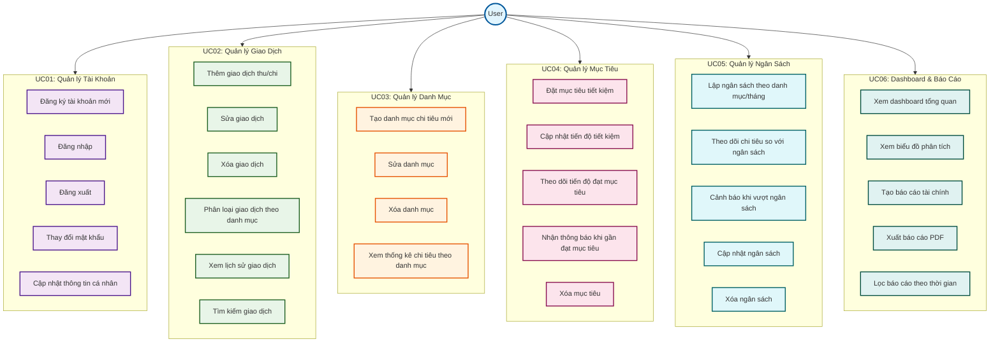

## Sơ Đồ Use Case Theo Nhóm

### UC01: Sơ Đồ Use Case - Quản Lý Tài Khoản

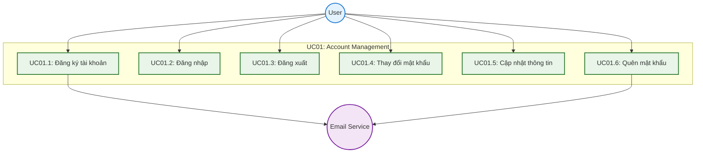

### UC02: Sơ Đồ Use Case - Quản Lý Giao Dịch

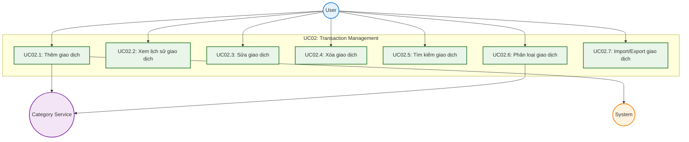

### UC03: Sơ Đồ Use Case - Quản Lý Danh Mục

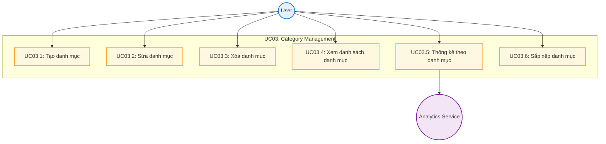

### UC04: Sơ Đồ Use Case - Quản Lý Mục Tiêu

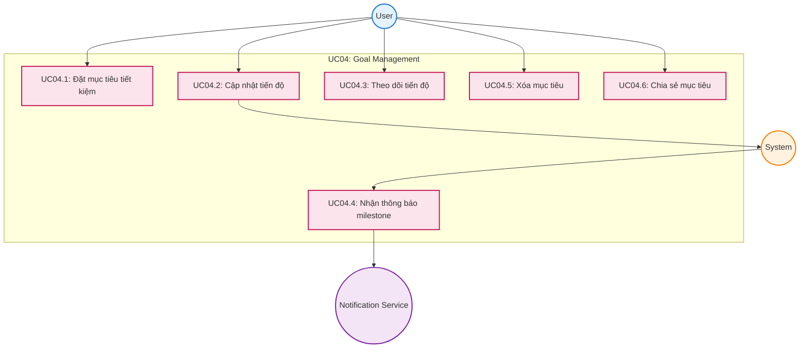

### UC05: Sơ Đồ Use Case - Quản Lý Ngân Sách

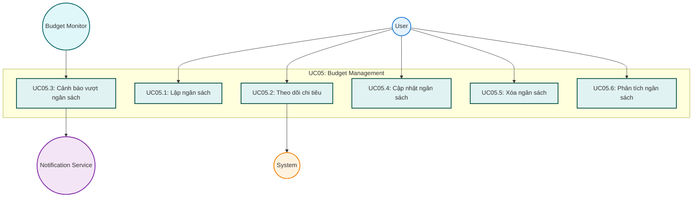

### UC06: Sơ Đồ Use Case - Dashboard & Báo Cáo

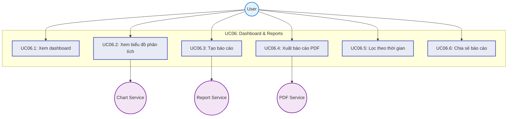

## Đặc Tả Use Case Quan Trọng

### UC01: Quản Lý Tài Khoản

#### UC01.1: Đăng ký tài khoản
| **Thuộc tính** | **Mô tả** |
|----------------|-----------|
| **Mô tả** | User tạo tài khoản mới để sử dụng FinTrack |
| **Luồng chính** | 1. User nhập thông tin (email, mật khẩu, họ tên, SĐT)<br>2. System validate và kiểm tra email unique<br>3. System mã hóa mật khẩu và lưu user<br>4. System gửi email xác nhận<br>5. User xác nhận email để kích hoạt tài khoản |
| **Quy tắc nghiệp vụ** | - Email phải unique trong hệ thống<br>- Mật khẩu tối thiểu 6 ký tự<br>- Bắt buộc xác nhận email trước khi sử dụng |

#### UC01.2: Đăng nhập
| **Thuộc tính** | **Mô tả** |
|----------------|-----------|
| **Mô tả** | User xác thực để truy cập hệ thống |
| **Luồng chính** | 1. User nhập email/password<br>2. System xác thực thông tin với database<br>3. System tạo JWT token và lưu HTTP-only cookie<br>4. System chuyển hướng đến Dashboard |
| **Quy tắc nghiệp vụ** | - Token hết hạn sau 7 ngày<br>- Khóa tài khoản sau 5 lần đăng nhập sai<br>- Sử dụng HTTPS và HTTP-only cookies |

### UC02: Quản Lý Giao Dịch

#### UC02.1: Thêm giao dịch
| **Thuộc tính** | **Mô tả** |
|----------------|-----------|
| **Mô tả** | User ghi lại giao dịch thu nhập hoặc chi tiêu |
| **Luồng chính** | 1. User chọn loại giao dịch (Thu/Chi)<br>2. User nhập số tiền, chọn danh mục, thêm ghi chú<br>3. System validate dữ liệu (số tiền > 0, danh mục hợp lệ)<br>4. System lưu giao dịch với timestamp hiện tại<br>5. System cập nhật tổng tiền của danh mục<br>6. System refresh dashboard và thống kê |
| **Quy tắc nghiệp vụ** | - Số tiền phải lớn hơn 0<br>- Danh mục phải cùng loại với giao dịch<br>- Timestamp tự động theo múi giờ VN (UTC+7) |

#### UC02.2: Xem lịch sử giao dịch
| **Thuộc tính** | **Mô tả** |
|----------------|-----------|
| **Mô tả** | User xem danh sách tất cả giao dịch với khả năng lọc |
| **Luồng chính** | 1. System hiển thị giao dịch theo thứ tự mới nhất<br>2. User có thể lọc theo: thời gian, danh mục, loại, số tiền<br>3. User có thể sắp xếp theo các cột<br>4. System hỗ trợ pagination (50 giao dịch/trang)<br>5. User có thể sửa/xóa từng giao dịch |
| **Quy tắc nghiệp vụ** | - Chỉ hiển thị giao dịch của user hiện tại<br>- Mặc định sắp xếp theo thời gian giảm dần<br>- Hỗ trợ export Excel/CSV |

### UC03: Quản Lý Danh Mục

#### UC03.1: Tạo danh mục
| **Thuộc tính** | **Mô tả** |
|----------------|-----------|
| **Mô tả** | User tạo danh mục mới để phân loại giao dịch |
| **Luồng chính** | 1. User nhập tên danh mục và chọn loại (Thu/Chi)<br>2. System kiểm tra tên không trùng với danh mục hiện có<br>3. System tạo danh mục với TotalAmount = 0<br>4. System lưu vào database và refresh danh sách |
| **Quy tắc nghiệp vụ** | - Tên danh mục unique trong cùng loại và user<br>- Mỗi user tối đa 50 danh mục<br>- Tên không chứa ký tự đặc biệt |

#### UC03.5: Thống kê theo danh mục
| **Thuộc tính** | **Mô tả** |
|----------------|-----------|
| **Mô tả** | User xem phân tích chi tiêu/thu nhập theo từng danh mục |
| **Luồng chính** | 1. System tính toán tổng tiền cho mỗi danh mục<br>2. System hiển thị biểu đồ tròn phân bố<br>3. System hiển thị bảng chi tiết với % và số tiền<br>4. User có thể lọc theo khoảng thời gian<br>5. User có thể so sánh với kỳ trước |
| **Quy tắc nghiệp vụ** | - Tính theo múi giờ địa phương<br>- Sắp xếp theo tổng tiền giảm dần<br>- Hỗ trợ export báo cáo |

### UC04: Quản Lý Mục Tiêu

#### UC04.1: Đặt mục tiêu tiết kiệm
| **Thuộc tính** | **Mô tả** |
|----------------|-----------|
| **Mô tả** | User tạo mục tiêu tiết kiệm với số tiền và thời hạn |
| **Luồng chính** | 1. User nhập tên mục tiêu, số tiền mục tiêu, deadline<br>2. System validate (số tiền > 0, deadline > ngày hiện tại)<br>3. System tính số tiền cần tiết kiệm mỗi tháng/tuần/ngày<br>4. System tạo mục tiêu với SavedAmount = 0<br>5. System thiết lập notifications cho milestone |
| **Quy tắc nghiệp vụ** | - Mỗi user tối đa 20 mục tiêu active<br>- Số tiền tối thiểu 100,000 VND<br>- Deadline tối đa 10 năm |

#### UC04.2: Cập nhật tiến độ
| **Thuộc tính** | **Mô tả** |
|----------------|-----------|
| **Mô tả** | User ghi nhận số tiền đã tiết kiệm cho mục tiêu |
| **Luồng chính** | 1. User chọn mục tiêu và nhập số tiền tiết kiệm<br>2. System validate số tiền > 0<br>3. System cập nhật SavedAmount và tính % hoàn thành<br>4. System kiểm tra milestone và gửi thông báo nếu cần<br>5. System cập nhật progress bar và UI |
| **Quy tắc nghiệp vụ** | - Tổng tiết kiệm không vượt 150% mục tiêu<br>- Tự động đánh dấu hoàn thành khi đạt 100%<br>- Gửi thông báo ở 25%, 50%, 75%, 90%, 100% |

### UC05: Quản Lý Ngân Sách

#### UC05.1: Lập ngân sách theo danh mục/tháng
| **Thuộc tính** | **Mô tả** |
|----------------|-----------|
| **Mô tả** | User thiết lập giới hạn chi tiêu cho từng danh mục trong tháng |
| **Luồng chính** | 1. User chọn tháng/năm và danh sách danh mục chi tiêu<br>2. User nhập số tiền giới hạn cho từng danh mục<br>3. System hiển thị tổng ngân sách và gợi ý dựa trên lịch sử<br>4. System validate và lưu ngân sách<br>5. System thiết lập monitoring cho tháng đó |
| **Quy tắc nghiệp vụ** | - Mỗi danh mục chỉ có 1 ngân sách/tháng<br>- Số tiền phải > 0<br>- Chỉ tạo cho tháng hiện tại và tương lai |

#### UC05.2: Theo dõi chi tiêu so với ngân sách
| **Thuộc tính** | **Mô tả** |
|----------------|-----------|
| **Mô tả** | User xem báo cáo chi tiêu thực tế so với ngân sách đã đặt |
| **Luồng chính** | 1. System hiển thị ngân sách tháng hiện tại<br>2. Với mỗi danh mục hiển thị: ngân sách, đã chi, còn lại, %<br>3. System dùng màu sắc: xanh (<70%), vàng (70-90%), đỏ (>90%)<br>4. System hiển thị tổng quan và dự đoán cuối tháng<br>5. User có thể xem chi tiết và so sánh với tháng trước |
| **Quy tắc nghiệp vụ** | - Cập nhật real-time khi có giao dịch mới<br>- Chỉ tính giao dịch chi tiêu trong tháng<br>- Tính theo múi giờ địa phương |

#### UC05.3: Cảnh báo khi vượt ngân sách
| **Thuộc tính** | **Mô tả** |
|----------------|-----------|
| **Mô tả** | System tự động gửi cảnh báo khi chi tiêu gần hoặc vượt ngân sách |
| **Luồng chính** | 1. System monitor chi tiêu real-time<br>2. Khi đạt ngưỡng (80%, 95%, 100%, 120%) gửi thông báo<br>3. System gửi qua in-app, push notification, email<br>4. User nhận thông báo và có thể xem chi tiết<br>5. System ghi log cảnh báo |
| **Quy tắc nghiệp vụ** | - Tối đa 1 cảnh báo/danh mục/ngày<br>- Cảnh báo nghiêm trọng (>120%) gửi ngay<br>- Respect user notification preferences |

### UC06: Dashboard & Báo Cáo

#### UC06.1: Xem dashboard tổng quan
| **Thuộc tính** | **Mô tả** |
|----------------|-----------|
| **Mô tả** | User xem trang chủ với tổng quan tài chính và thông tin quan trọng |
| **Luồng chính** | 1. System load và hiển thị các widget chính:<br>   - Balance Card (tổng số dư, thu nhập, chi tiêu)<br>   - Quick Transaction Form<br>   - Recent Transactions (5-10 giao dịch gần nhất)<br>   - Goal Progress (top 3 mục tiêu)<br>   - Budget Overview (ngân sách tháng hiện tại)<br>2. User có thể thêm giao dịch nhanh và xem chi tiết |
| **Quy tắc nghiệp vụ** | - Cập nhật real-time khi có thay đổi<br>- Cache dữ liệu để tăng tốc độ<br>- Responsive cho mọi thiết bị |

#### UC06.2: Xem biểu đồ phân tích
| **Thuộc tính** | **Mô tả** |
|----------------|-----------|
| **Mô tả** | User xem các biểu đồ trực quan để phân tích xu hướng tài chính |
| **Luồng chính** | 1. System hiển thị các biểu đồ chính:<br>   - Pie Chart: Chi tiêu theo danh mục<br>   - Line Chart: Xu hướng thu chi theo thời gian<br>   - Bar Chart: So sánh các tháng<br>   - Progress Bars: Ngân sách vs thực tế<br>2. User có thể tương tác, zoom, drill-down<br>3. User có thể thay đổi khoảng thời gian |
| **Quy tắc nghiệp vụ** | - Sử dụng màu sắc consistent<br>- Hỗ trợ export PNG/SVG<br>- Interactive với animation |

#### UC06.3: Tạo báo cáo tài chính
| **Thuộc tính** | **Mô tả** |
|----------------|-----------|
| **Mô tả** | User tạo báo cáo tài chính chi tiết cho khoảng thời gian cụ thể |
| **Luồng chính** | 1. User chọn loại báo cáo và khoảng thời gian<br>2. User chọn nội dung: tóm tắt, phân tích danh mục, xu hướng, so sánh<br>3. System thu thập dữ liệu và tính toán các chỉ số<br>4. System tạo báo cáo với charts và tables<br>5. System hiển thị preview và cho phép tải xuống |
| **Quy tắc nghiệp vụ** | - Khoảng thời gian tối đa 2 năm<br>- Lưu báo cáo trong 90 ngày<br>- Watermark với thông tin user |

#### UC06.4: Xuất báo cáo PDF
| **Thuộc tính** | **Mô tả** |
|----------------|-----------|
| **Mô tả** | User tải xuống báo cáo dưới dạng file PDF |
| **Luồng chính** | 1. User chọn tùy chọn xuất (định dạng, orientation, nội dung)<br>2. System render báo cáo thành HTML<br>3. System convert HTML sang PDF với high-quality charts<br>4. System tạo download link và user tải xuống<br>5. System xóa file tạm sau 24h |
| **Quy tắc nghiệp vụ** | - File PDF tối đa 50MB<br>- Watermark với timestamp<br>- Professional layout |

## Tóm Tắt Tính Năng Chính

### 🔐 **Quản Lý Tài Khoản**
- Đăng ký/đăng nhập với JWT authentication
- Quản lý thông tin cá nhân và bảo mật
- Email verification và password recovery

### 💰 **Quản Lý Giao Dịch**
- Thêm/sửa/xóa giao dịch thu chi
- Phân loại theo danh mục tự động
- Tìm kiếm và lọc giao dịch
- Import/Export dữ liệu

### 📊 **Quản Lý Danh Mục**
- Tạo danh mục thu nhập và chi tiêu
- Thống kê và phân tích theo danh mục
- Biểu đồ trực quan phân bố chi tiêu

### 🎯 **Quản Lý Mục Tiêu**
- Đặt mục tiêu tiết kiệm với deadline
- Theo dõi tiến độ real-time
- Thông báo milestone tự động
- Phân tích xu hướng tiết kiệm

### 💼 **Quản Lý Ngân Sách**
- Lập ngân sách theo danh mục/tháng
- Monitor chi tiêu vs ngân sách
- Cảnh báo tự động khi vượt ngân sách
- Phân tích và đề xuất điều chỉnh

### 📈 **Dashboard & Báo Cáo**
- Dashboard tổng quan với widgets
- Biểu đồ phân tích đa dạng
- Báo cáo tài chính chi tiết
- Export PDF/Excel chuyên nghiệp

## Luồng Hoạt Động Chính

### 🚀 **Luồng Onboarding**
1. **Đăng ký** → Xác nhận email → **Đăng nhập**
2. **Tạo danh mục** cơ bản (Ăn uống, Di chuyển, Giải trí...)
3. **Thêm giao dịch** đầu tiên để làm quen
4. **Đặt mục tiêu** tiết kiệm đầu tiên
5. **Lập ngân sách** cho tháng hiện tại

### 📱 **Luồng Sử Dụng Hàng Ngày**
1. **Mở app** → Xem Dashboard tổng quan
2. **Thêm giao dịch** mới qua Quick Form
3. **Kiểm tra ngân sách** và mục tiêu
4. **Xem thông báo** cảnh báo (nếu có)
5. **Cập nhật tiến độ** mục tiêu (nếu cần)

### 📊 **Luồng Phân Tích Định Kỳ**
1. **Xem báo cáo** tháng/quý
2. **Phân tích chi tiêu** theo danh mục
3. **So sánh** với kỳ trước
4. **Điều chỉnh ngân sách** tháng sau
5. **Đặt mục tiêu** mới nếu cần

---

*Tài liệu này cung cấp tổng quan về hệ thống FinTrack với 5 nhóm chức năng chính và 30+ use cases chi tiết. Các sơ đồ Mermaid giúp visualize mối quan hệ giữa actors và use cases một cách rõ ràng.*

## Sơ Đồ Sequence - Đăng Nhập

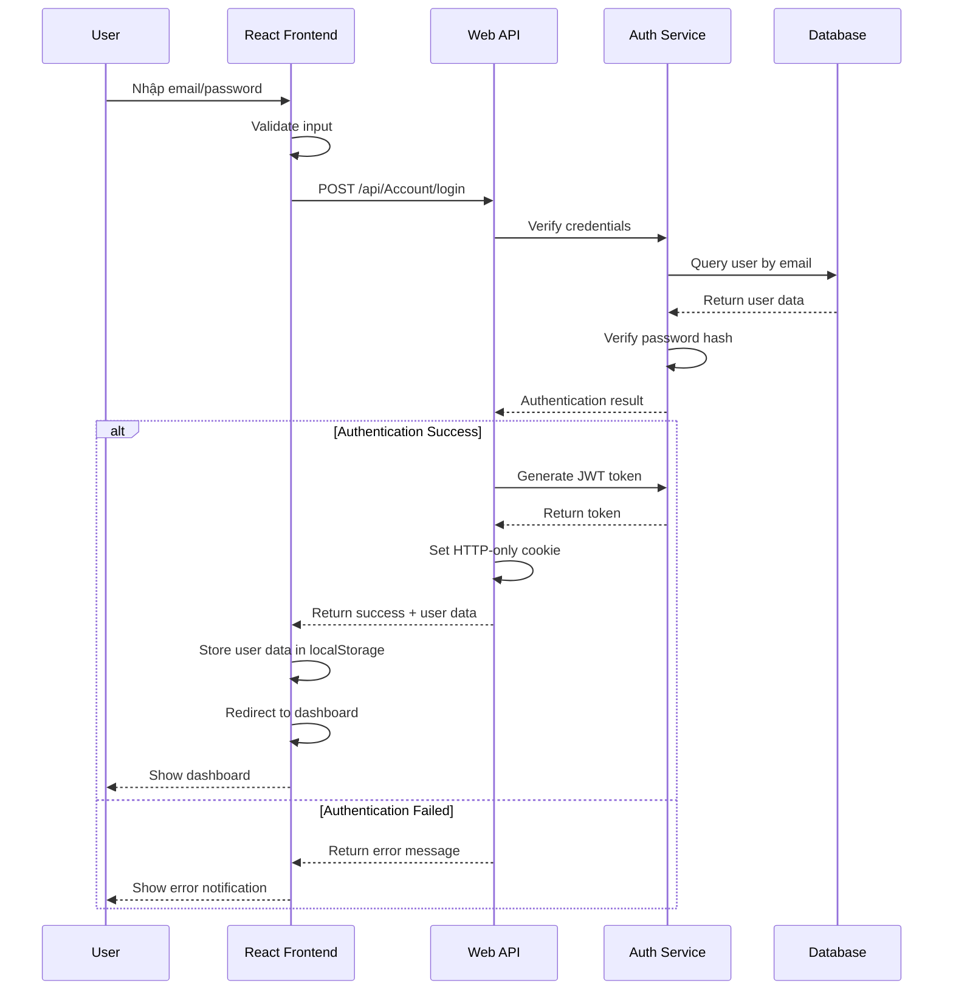

## Sơ Đồ Sequence - Thêm Giao Dịch

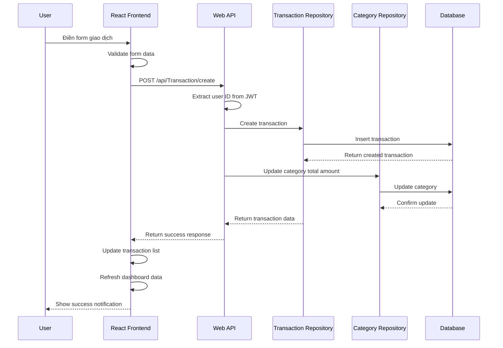

### UC01.3: Đăng xuất

| **Thuộc tính** | **Mô tả** |
|----------------|-----------|
| **Use Case ID** | UC01.3 |
| **Tên Use Case** | Đăng xuất |
| **Mô tả** | Người dùng kết thúc phiên làm việc và thoát khỏi hệ thống |
| **Actor chính** | User (Người dùng đã đăng nhập) |
| **Actor phụ** | Authentication Service |
| **Điều kiện tiên quyết** | - User đã đăng nhập<br>- Có JWT token hợp lệ |
| **Điều kiện kết thúc** | - Session được kết thúc<br>- Token bị vô hiệu hóa<br>- User được chuyển đến trang đăng nhập |
| **Luồng chính** | 1. User nhấn nút "Đăng xuất" trên giao diện<br>2. System hiển thị dialog xác nhận đăng xuất<br>3. User xác nhận đăng xuất<br>4. System gửi request đăng xuất đến server<br>5. Server thêm token vào blacklist<br>6. Server xóa HTTP-only cookie<br>7. Client xóa thông tin user khỏi localStorage<br>8. Client xóa token khỏi memory<br>9. System chuyển hướng đến trang đăng nhập<br>10. System hiển thị thông báo "Đăng xuất thành công" |
| **Luồng thay thế** | **3a. User hủy đăng xuất:**<br>3a1. System đóng dialog<br>3a2. User tiếp tục sử dụng hệ thống<br><br>**Auto logout khi token hết hạn:**<br>1. System phát hiện token hết hạn<br>2. System tự động đăng xuất user<br>3. System hiển thị "Phiên làm việc đã hết hạn"<br>4. System chuyển đến trang đăng nhập |
| **Luồng ngoại lệ** | **E1. Lỗi kết nối server:**<br>E1.1. Client vẫn thực hiện đăng xuất local<br>E1.2. Client xóa token và user data<br>E1.3. Client chuyển đến trang đăng nhập<br><br>**E2. Token đã bị vô hiệu:**<br>E2.1. Server trả về lỗi 401<br>E2.2. Client xử lý như đăng xuất thành công |
| **Quy tắc nghiệp vụ** | - Token phải được blacklist ngay lập tức<br>- Tất cả dữ liệu nhạy cảm phải được xóa khỏi client<br>- Không lưu lại thông tin session |
| **Yêu cầu đặc biệt** | - Đảm bảo bảo mật khi đăng xuất<br>- Thời gian phản hồi < 1 giây<br>- Hoạt động offline nếu cần |
| **Tần suất sử dụng** | Trung bình (1-2 lần/session) |

### UC01.4: Thay đổi mật khẩu

| **Thuộc tính** | **Mô tả** |
|----------------|-----------|
| **Use Case ID** | UC01.4 |
| **Tên Use Case** | Thay đổi mật khẩu |
| **Mô tả** | Người dùng thay đổi mật khẩu hiện tại thành mật khẩu mới |
| **Actor chính** | User (Người dùng đã đăng nhập) |
| **Actor phụ** | Authentication Service |
| **Điều kiện tiên quyết** | - User đã đăng nhập<br>- Biết mật khẩu hiện tại |
| **Điều kiện kết thúc** | - Mật khẩu được cập nhật thành công<br>- Hash mật khẩu mới được lưu vào database<br>- User nhận thông báo thành công |
| **Luồng chính** | 1. User truy cập trang "Cài đặt tài khoản"<br>2. User nhấn "Thay đổi mật khẩu"<br>3. System hiển thị form thay đổi mật khẩu<br>4. User nhập mật khẩu hiện tại<br>5. User nhập mật khẩu mới<br>6. User xác nhận mật khẩu mới<br>7. User nhấn "Cập nhật mật khẩu"<br>8. System validate mật khẩu hiện tại<br>9. System validate mật khẩu mới (độ mạnh, độ dài)<br>10. System kiểm tra mật khẩu xác nhận khớp<br>11. System mã hóa mật khẩu mới bằng BCrypt<br>12. System cập nhật hash mật khẩu trong database<br>13. System hiển thị thông báo "Mật khẩu đã được cập nhật" |
| **Luồng thay thế** | **8a. Mật khẩu hiện tại sai:**<br>8a1. System hiển thị "Mật khẩu hiện tại không đúng"<br>8a2. User nhập lại mật khẩu hiện tại<br>8a3. Quay lại bước 8<br><br>**9a. Mật khẩu mới không hợp lệ:**<br>9a1. System hiển thị lỗi validation cụ thể<br>9a2. User nhập mật khẩu mới hợp lệ<br>9a3. Quay lại bước 9<br><br>**10a. Mật khẩu xác nhận không khớp:**<br>10a1. System hiển thị "Mật khẩu xác nhận không khớp"<br>10a2. User nhập lại mật khẩu xác nhận<br>10a3. Quay lại bước 10 |
| **Luồng ngoại lệ** | **E1. Lỗi cập nhật database:**<br>E1.1. System hiển thị "Lỗi hệ thống, vui lòng thử lại"<br>E1.2. System ghi log lỗi<br>E1.3. Mật khẩu không được thay đổi<br><br>**E2. Session hết hạn:**<br>E2.1. System chuyển đến trang đăng nhập<br>E2.2. System hiển thị "Phiên làm việc đã hết hạn" |
| **Quy tắc nghiệp vụ** | - Mật khẩu mới phải khác mật khẩu hiện tại<br>- Mật khẩu tối thiểu 6 ký tự<br>- Phải có ít nhất 1 chữ hoa, 1 chữ thường, 1 số<br>- Không được chứa thông tin cá nhân |
| **Yêu cầu đặc biệt** | - Sử dụng HTTPS<br>- Mật khẩu không được log<br>- Hash bằng BCrypt với salt rounds >= 10 |
| **Tần suất sử dụng** | Thấp (vài lần/năm) |

### UC01.5: Cập nhật thông tin cá nhân

| **Thuộc tính** | **Mô tả** |
|----------------|-----------|
| **Use Case ID** | UC01.5 |
| **Tên Use Case** | Cập nhật thông tin cá nhân |
| **Mô tả** | Người dùng chỉnh sửa thông tin cá nhân như họ tên, số điện thoại, địa chỉ |
| **Actor chính** | User (Người dùng đã đăng nhập) |
| **Actor phụ** | Không có |
| **Điều kiện tiên quyết** | - User đã đăng nhập<br>- Có quyền chỉnh sửa thông tin |
| **Điều kiện kết thúc** | - Thông tin cá nhân được cập nhật<br>- Dữ liệu được lưu vào database<br>- User nhận thông báo thành công |
| **Luồng chính** | 1. User truy cập trang "Cài đặt tài khoản"<br>2. System hiển thị form với thông tin hiện tại<br>3. User chỉnh sửa các trường cần thiết:<br>   - Họ tên<br>   - Số điện thoại<br>   - Thành phố<br>   - Quận/Huyện<br>   - Phường/Xã<br>4. User nhấn "Cập nhật thông tin"<br>5. System validate dữ liệu đầu vào<br>6. System kiểm tra số điện thoại unique (nếu thay đổi)<br>7. System cập nhật thông tin trong database<br>8. System cập nhật thông tin trong localStorage<br>9. System hiển thị thông báo "Thông tin đã được cập nhật" |
| **Luồng thay thế** | **5a. Dữ liệu không hợp lệ:**<br>5a1. System hiển thị lỗi validation cụ thể<br>5a2. User sửa thông tin<br>5a3. Quay lại bước 5<br><br>**6a. Số điện thoại đã tồn tại:**<br>6a1. System hiển thị "Số điện thoại đã được sử dụng"<br>6a2. User nhập số điện thoại khác<br>6a3. Quay lại bước 5<br><br>**User không thay đổi gì:**<br>1. User nhấn "Cập nhật" mà không sửa<br>2. System hiển thị "Không có thay đổi nào" |
| **Luồng ngoại lệ** | **E1. Lỗi cập nhật database:**<br>E1.1. System hiển thị "Lỗi hệ thống, vui lòng thử lại"<br>E1.2. System ghi log lỗi<br>E1.3. Thông tin không được thay đổi<br><br>**E2. Session hết hạn:**<br>E2.1. System chuyển đến trang đăng nhập<br>E2.2. System hiển thị "Phiên làm việc đã hết hạn" |
| **Quy tắc nghiệp vụ** | - Họ tên không được để trống<br>- Số điện thoại phải đúng định dạng VN<br>- Email không được thay đổi (cần use case riêng)<br>- Thông tin địa chỉ có thể để trống |
| **Yêu cầu đặc biệt** | - Validate real-time khi user nhập<br>- Tự động lưu draft mỗi 30 giây<br>- Thời gian phản hồi < 2 giây |
| **Tần suất sử dụng** | Thấp (vài lần/năm) |

### UC02.1: Thêm giao dịch thu/chi

| **Thuộc tính** | **Mô tả** |
|----------------|-----------|
| **Use Case ID** | UC02.1 |
| **Tên Use Case** | Thêm giao dịch thu/chi |
| **Mô tả** | Người dùng ghi lại một giao dịch thu nhập hoặc chi tiêu mới |
| **Actor chính** | User (Người dùng đã đăng nhập) |
| **Actor phụ** | Category Service |
| **Điều kiện tiên quyết** | - User đã đăng nhập<br>- Có ít nhất 1 danh mục tương ứng với loại giao dịch |
| **Điều kiện kết thúc** | - Giao dịch được lưu vào database<br>- Tổng tiền danh mục được cập nhật<br>- Dashboard được refresh |
| **Luồng chính** | 1. User truy cập Dashboard hoặc trang Transactions<br>2. User nhấn "Thêm giao dịch" hoặc sử dụng form nhanh<br>3. System hiển thị form thêm giao dịch<br>4. User chọn loại giao dịch (Thu nhập/Chi tiêu)<br>5. System load danh sách danh mục theo loại đã chọn<br>6. User nhập số tiền<br>7. User chọn danh mục từ dropdown<br>8. User nhập ghi chú (tùy chọn)<br>9. User đánh dấu "Quan trọng" (tùy chọn)<br>10. User nhấn "Thêm giao dịch"<br>11. System validate dữ liệu đầu vào<br>12. System tạo giao dịch với timestamp hiện tại<br>13. System cập nhật tổng tiền của danh mục<br>14. System lưu giao dịch vào database<br>15. System hiển thị thông báo thành công<br>16. System refresh danh sách giao dịch và dashboard |
| **Luồng thay thế** | **4a. Chưa có danh mục cho loại giao dịch:**<br>4a1. System hiển thị "Chưa có danh mục cho loại này"<br>4a2. System đề xuất tạo danh mục mới<br>4a3. User có thể tạo danh mục hoặc hủy<br><br>**11a. Dữ liệu không hợp lệ:**<br>11a1. System hiển thị lỗi validation cụ thể<br>11a2. User sửa thông tin<br>11a3. Quay lại bước 11<br><br>**Thêm giao dịch nhanh từ Dashboard:**<br>1. User sử dụng form nhanh trên Dashboard<br>2. Form có sẵn các trường cơ bản<br>3. Sau khi thêm, form được reset để thêm tiếp |
| **Luồng ngoại lệ** | **E1. Lỗi lưu database:**<br>E1.1. System hiển thị "Lỗi hệ thống, vui lòng thử lại"<br>E1.2. System ghi log lỗi<br>E1.3. Giao dịch không được lưu<br><br>**E2. Lỗi cập nhật danh mục:**<br>E2.1. Giao dịch vẫn được lưu<br>E2.2. System ghi log lỗi<br>E2.3. Admin được thông báo để xử lý |
| **Quy tắc nghiệp vụ** | - Số tiền phải > 0<br>- Danh mục phải tồn tại và thuộc về user<br>- Loại giao dịch phải khớp với loại danh mục<br>- Timestamp tự động = thời gian hiện tại (UTC+7) |
| **Yêu cầu đặc biệt** | - Form validation real-time<br>- Auto-complete cho ghi chú dựa trên lịch sử<br>- Thời gian phản hồi < 2 giây |
| **Tần suất sử dụng** | Rất cao (nhiều lần/ngày) |

### UC02.2: Sửa giao dịch

| **Thuộc tính** | **Mô tả** |
|----------------|-----------|
| **Use Case ID** | UC02.2 |
| **Tên Use Case** | Sửa giao dịch |
| **Mô tả** | Người dùng chỉnh sửa thông tin của một giao dịch đã tồn tại |
| **Actor chính** | User (Người dùng đã đăng nhập) |
| **Actor phụ** | Category Service |
| **Điều kiện tiên quyết** | - User đã đăng nhập<br>- Giao dịch tồn tại và thuộc về user<br>- User có quyền chỉnh sửa |
| **Điều kiện kết thúc** | - Giao dịch được cập nhật<br>- Tổng tiền danh mục được điều chỉnh<br>- Lịch sử thay đổi được ghi lại |
| **Luồng chính** | 1. User truy cập trang Transactions<br>2. User tìm giao dịch cần sửa<br>3. User nhấn icon "Sửa" trên giao dịch<br>4. System hiển thị form sửa với dữ liệu hiện tại<br>5. User chỉnh sửa các trường cần thiết:<br>   - Số tiền<br>   - Loại giao dịch<br>   - Danh mục<br>   - Ghi chú<br>   - Trạng thái quan trọng<br>6. User nhấn "Cập nhật"<br>7. System validate dữ liệu mới<br>8. System tính toán sự thay đổi cho danh mục<br>9. System cập nhật giao dịch trong database<br>10. System điều chỉnh tổng tiền danh mục cũ và mới<br>11. System ghi log thay đổi<br>12. System hiển thị thông báo thành công<br>13. System refresh danh sách giao dịch |
| **Luồng thay thế** | **3a. Giao dịch không thuộc về user:**<br>3a1. System hiển thị "Không có quyền truy cập"<br>3a2. Use case kết thúc<br><br>**5a. Thay đổi loại giao dịch:**<br>5a1. System load lại danh sách danh mục<br>5a2. User chọn danh mục mới<br>5a3. Tiếp tục luồng chính<br><br>**User không thay đổi gì:**<br>1. User nhấn "Cập nhật" mà không sửa<br>2. System hiển thị "Không có thay đổi nào"<br>3. Form được đóng |
| **Luồng ngoại lệ** | **E1. Giao dịch đã bị xóa:**<br>E1.1. System hiển thị "Giao dịch không tồn tại"<br>E1.2. System refresh danh sách<br><br>**E2. Lỗi cập nhật database:**<br>E2.1. System hiển thị "Lỗi hệ thống"<br>E2.2. Dữ liệu không được thay đổi<br>E2.3. System ghi log lỗi |
| **Quy tắc nghiệp vụ** | - Chỉ được sửa giao dịch của chính mình<br>- Không được sửa timestamp tạo<br>- Phải cập nhật tổng tiền danh mục tương ứng<br>- Ghi lại lịch sử thay đổi |
| **Yêu cầu đặc biệt** | - Hiển thị preview thay đổi trước khi lưu<br>- Undo/Redo trong 5 phút<br>- Thời gian phản hồi < 2 giây |
| **Tần suất sử dụng** | Trung bình (vài lần/tuần) |

### UC02.3: Xóa giao dịch

| **Thuộc tính** | **Mô tả** |
|----------------|-----------|
| **Use Case ID** | UC02.3 |
| **Tên Use Case** | Xóa giao dịch |
| **Mô tả** | Người dùng xóa một giao dịch không còn cần thiết hoặc nhập sai |
| **Actor chính** | User (Người dùng đã đăng nhập) |
| **Actor phụ** | Category Service |
| **Điều kiện tiên quyết** | - User đã đăng nhập<br>- Giao dịch tồn tại và thuộc về user<br>- User có quyền xóa |
| **Điều kiện kết thúc** | - Giao dịch được xóa khỏi database<br>- Tổng tiền danh mục được điều chỉnh<br>- Lịch sử xóa được ghi lại |
| **Luồng chính** | 1. User truy cập trang Transactions<br>2. User tìm giao dịch cần xóa<br>3. User nhấn icon "Xóa" trên giao dịch<br>4. System hiển thị dialog xác nhận xóa<br>5. Dialog hiển thị thông tin giao dịch sẽ bị xóa<br>6. User xác nhận xóa<br>7. System kiểm tra quyền xóa<br>8. System trừ số tiền khỏi tổng danh mục<br>9. System xóa giao dịch khỏi database<br>10. System ghi log hoạt động xóa<br>11. System hiển thị thông báo "Đã xóa giao dịch"<br>12. System refresh danh sách giao dịch<br>13. System cập nhật dashboard nếu cần |
| **Luồng thay thế** | **6a. User hủy xóa:**<br>6a1. System đóng dialog xác nhận<br>6a2. Giao dịch không bị xóa<br>6a3. Use case kết thúc<br><br>**7a. Không có quyền xóa:**<br>7a1. System hiển thị "Không có quyền xóa"<br>7a2. Use case kết thúc<br><br>**Xóa nhiều giao dịch cùng lúc:**<br>1. User chọn checkbox nhiều giao dịch<br>2. User nhấn "Xóa đã chọn"<br>3. System hiển thị số lượng giao dịch sẽ xóa<br>4. User xác nhận<br>5. System xóa từng giao dịch và cập nhật danh mục |
| **Luồng ngoại lệ** | **E1. Giao dịch đã bị xóa:**<br>E1.1. System hiển thị "Giao dịch không tồn tại"<br>E1.2. System refresh danh sách<br><br>**E2. Lỗi xóa database:**<br>E2.1. System hiển thị "Lỗi hệ thống, không thể xóa"<br>E2.2. Giao dịch không bị xóa<br>E2.3. System ghi log lỗi<br><br>**E3. Lỗi cập nhật danh mục:**<br>E3.1. Giao dịch vẫn bị xóa<br>E3.2. System ghi log lỗi<br>E3.3. Admin được thông báo để xử lý |
| **Quy tắc nghiệp vụ** | - Chỉ được xóa giao dịch của chính mình<br>- Phải xác nhận trước khi xóa<br>- Cập nhật tổng tiền danh mục ngay lập tức<br>- Ghi lại log để audit |
| **Yêu cầu đặc biệt** | - Soft delete (đánh dấu xóa) thay vì hard delete<br>- Có thể khôi phục trong 30 ngày<br>- Thời gian phản hồi < 1 giây |
| **Tần suất sử dụng** | Thấp (vài lần/tháng) |

### UC02.4: Phân loại giao dịch theo danh mục

| **Thuộc tính** | **Mô tả** |
|----------------|-----------|
| **Use Case ID** | UC02.4 |
| **Tên Use Case** | Phân loại giao dịch theo danh mục |
| **Mô tả** | Người dùng gán giao dịch vào danh mục phù hợp để quản lý và phân tích |
| **Actor chính** | User (Người dùng đã đăng nhập) |
| **Actor phụ** | Category Service, AI Suggestion Service |
| **Điều kiện tiên quyết** | - User đã đăng nhập<br>- Có ít nhất 1 danh mục<br>- Giao dịch chưa được phân loại hoặc cần đổi danh mục |
| **Điều kiện kết thúc** | - Giao dịch được gán vào danh mục<br>- Tổng tiền danh mục được cập nhật<br>- Thống kê theo danh mục được refresh |
| **Luồng chính** | 1. User truy cập trang Transactions<br>2. User xem danh sách giao dịch chưa phân loại<br>3. User chọn giao dịch cần phân loại<br>4. System hiển thị dropdown danh mục theo loại giao dịch<br>5. System đề xuất danh mục dựa trên:<br>   - Ghi chú giao dịch<br>   - Lịch sử phân loại<br>   - AI pattern recognition<br>6. User chọn danh mục phù hợp<br>7. System validate danh mục và loại giao dịch khớp<br>8. System cập nhật giao dịch với danh mục mới<br>9. System cập nhật tổng tiền danh mục<br>10. System hiển thị thông báo thành công<br>11. System cập nhật thống kê danh mục |
| **Luồng thay thế** | **2a. Tất cả giao dịch đã được phân loại:**<br>2a1. System hiển thị "Tất cả giao dịch đã có danh mục"<br>2a2. User có thể thay đổi danh mục hiện có<br><br>**5a. Không có đề xuất phù hợp:**<br>5a1. System hiển thị tất cả danh mục có sẵn<br>5a2. User tự chọn danh mục<br><br>**Phân loại hàng loạt:**<br>1. User chọn nhiều giao dịch cùng loại<br>2. User chọn "Phân loại hàng loạt"<br>3. User chọn danh mục chung<br>4. System áp dụng cho tất cả giao dịch đã chọn<br><br>**Tạo danh mục mới trong quá trình phân loại:**<br>1. User chọn "Tạo danh mục mới"<br>2. System mở form tạo danh mục<br>3. User tạo danh mục<br>4. System tự động gán giao dịch vào danh mục mới |
| **Luồng ngoại lệ** | **E1. Danh mục không tồn tại:**<br>E1.1. System hiển thị "Danh mục không hợp lệ"<br>E1.2. System refresh danh sách danh mục<br><br>**E2. Loại giao dịch không khớp với danh mục:**<br>E2.1. System hiển thị "Danh mục không phù hợp với loại giao dịch"<br>E2.2. User chọn danh mục khác<br><br>**E3. Lỗi cập nhật:**<br>E3.1. System hiển thị "Lỗi phân loại"<br>E3.2. Giao dịch giữ nguyên danh mục cũ |
| **Quy tắc nghiệp vụ** | - Danh mục phải cùng loại với giao dịch (thu/chi)<br>- Một giao dịch chỉ thuộc một danh mục<br>- Tự động cập nhật tổng tiền danh mục<br>- Lưu lại pattern để đề xuất lần sau |
| **Yêu cầu đặc biệt** | - AI học từ hành vi phân loại của user<br>- Đề xuất real-time khi user nhập ghi chú<br>- Bulk operations cho nhiều giao dịch |
| **Tần suất sử dụng** | Cao (mỗi khi thêm giao dịch mới) |

### UC02.5: Xem lịch sử giao dịch

| **Thuộc tính** | **Mô tả** |
|----------------|-----------|
| **Use Case ID** | UC02.5 |
| **Tên Use Case** | Xem lịch sử giao dịch |
| **Mô tả** | Người dùng xem danh sách tất cả giao dịch đã thực hiện với các tùy chọn lọc và sắp xếp |
| **Actor chính** | User (Người dùng đã đăng nhập) |
| **Actor phụ** | Không có |
| **Điều kiện tiên quyết** | - User đã đăng nhập<br>- Có ít nhất 1 giao dịch trong hệ thống |
| **Điều kiện kết thúc** | - Danh sách giao dịch được hiển thị<br>- User có thể thao tác với từng giao dịch |
| **Luồng chính** | 1. User truy cập trang "Transactions"<br>2. System load danh sách giao dịch của user<br>3. System hiển thị giao dịch theo thứ tự mới nhất trước<br>4. Mỗi giao dịch hiển thị:<br>   - Ngày giờ<br>   - Loại (Thu/Chi)<br>   - Số tiền<br>   - Danh mục<br>   - Ghi chú<br>   - Trạng thái quan trọng<br>   - Actions (Sửa/Xóa)<br>5. System hiển thị pagination nếu có nhiều giao dịch<br>6. User có thể:<br>   - Xem chi tiết giao dịch<br>   - Sửa giao dịch<br>   - Xóa giao dịch<br>   - Lọc theo tiêu chí<br>   - Sắp xếp theo cột |
| **Luồng thay thế** | **2a. Chưa có giao dịch nào:**<br>2a1. System hiển thị "Chưa có giao dịch nào"<br>2a2. System hiển thị nút "Thêm giao dịch đầu tiên"<br>2a3. User có thể tạo giao dịch mới<br><br>**Lọc theo khoảng thời gian:**<br>1. User chọn "Lọc theo ngày"<br>2. User chọn từ ngày - đến ngày<br>3. System hiển thị giao dịch trong khoảng thời gian<br><br>**Lọc theo danh mục:**<br>1. User chọn danh mục từ dropdown<br>2. System hiển thị chỉ giao dịch của danh mục đó<br><br>**Lọc theo loại:**<br>1. User chọn "Thu nhập" hoặc "Chi tiêu"<br>2. System hiển thị giao dịch theo loại đã chọn<br><br>**Sắp xếp:**<br>1. User nhấn vào header cột<br>2. System sắp xếp theo cột đó (tăng/giảm dần) |
| **Luồng ngoại lệ** | **E1. Lỗi load dữ liệu:**<br>E1.1. System hiển thị "Lỗi tải dữ liệu"<br>E1.2. System hiển thị nút "Thử lại"<br>E1.3. User có thể refresh trang<br><br>**E2. Quá nhiều dữ liệu:**<br>E2.1. System hiển thị cảnh báo "Quá nhiều kết quả"<br>E2.2. System đề xuất thu hẹp bộ lọc<br>E2.3. Chỉ hiển thị 1000 giao dịch đầu tiên |
| **Quy tắc nghiệp vụ** | - Chỉ hiển thị giao dịch của user hiện tại<br>- Mặc định sắp xếp theo thời gian mới nhất<br>- Pagination 50 giao dịch/trang<br>- Lưu trạng thái filter trong session |
| **Yêu cầu đặc biệt** | - Lazy loading khi scroll<br>- Export to Excel/CSV<br>- Responsive design cho mobile<br>- Thời gian load < 3 giây |
| **Tần suất sử dụng** | Cao (hàng ngày) |

### UC02.6: Tìm kiếm giao dịch

| **Thuộc tính** | **Mô tả** |
|----------------|-----------|
| **Use Case ID** | UC02.6 |
| **Tên Use Case** | Tìm kiếm giao dịch |
| **Mô tả** | Người dùng tìm kiếm giao dịch cụ thể dựa trên các tiêu chí khác nhau |
| **Actor chính** | User (Người dùng đã đăng nhập) |
| **Actor phụ** | Search Engine |
| **Điều kiện tiên quyết** | - User đã đăng nhập<br>- Có giao dịch trong hệ thống |
| **Điều kiện kết thúc** | - Kết quả tìm kiếm được hiển thị<br>- User có thể thao tác với kết quả |
| **Luồng chính** | 1. User truy cập trang Transactions<br>2. User nhập từ khóa vào ô tìm kiếm<br>3. System tìm kiếm real-time trong các trường:<br>   - Ghi chú giao dịch<br>   - Tên danh mục<br>   - Số tiền (exact match)<br>4. System hiển thị kết quả phù hợp<br>5. System highlight từ khóa trong kết quả<br>6. User có thể:<br>   - Xem chi tiết giao dịch tìm được<br>   - Sửa/xóa giao dịch<br>   - Lọc thêm trong kết quả<br>7. System lưu lịch sử tìm kiếm |
| **Luồng thay thế** | **Tìm kiếm nâng cao:**<br>1. User nhấn "Tìm kiếm nâng cao"<br>2. System hiển thị form với nhiều tiêu chí:<br>   - Khoảng số tiền (từ - đến)<br>   - Khoảng thời gian<br>   - Danh mục cụ thể<br>   - Loại giao dịch<br>   - Trạng thái quan trọng<br>3. User điền các tiêu chí<br>4. User nhấn "Tìm kiếm"<br>5. System thực hiện tìm kiếm với tất cả tiêu chí<br><br>**Tìm kiếm bằng voice:**<br>1. User nhấn icon microphone<br>2. User nói từ khóa<br>3. System convert speech to text<br>4. System thực hiện tìm kiếm với text<br><br>**Tìm kiếm gần đúng:**<br>1. Nếu không có kết quả chính xác<br>2. System đề xuất kết quả tương tự<br>3. System hiển thị "Có phải bạn muốn tìm..." |
| **Luồng ngoại lệ** | **E1. Không tìm thấy kết quả:**<br>E1.1. System hiển thị "Không tìm thấy giao dịch nào"<br>E1.2. System đề xuất:<br>   - Kiểm tra lại từ khóa<br>   - Mở rộng khoảng thời gian<br>   - Xóa bộ lọc<br><br>**E2. Từ khóa quá ngắn:**<br>E2.1. System yêu cầu ít nhất 2 ký tự<br>E2.2. System hiển thị gợi ý từ khóa phổ biến<br><br>**E3. Lỗi search engine:**<br>E3.1. System fallback về tìm kiếm cơ bản<br>E3.2. System ghi log lỗi |
| **Quy tắc nghiệp vụ** | - Chỉ tìm trong giao dịch của user hiện tại<br>- Tìm kiếm không phân biệt hoa thường<br>- Hỗ trợ wildcard (*) và regex cơ bản<br>- Lưu 10 từ khóa tìm kiếm gần nhất |
| **Yêu cầu đặc biệt** | - Auto-complete từ lịch sử tìm kiếm<br>- Highlight kết quả tìm được<br>- Thời gian phản hồi < 1 giây<br>- Hỗ trợ tìm kiếm tiếng Việt có dấu |
| **Tần suất sử dụng** | Trung bình (vài lần/tuần) |

### UC03.1: Tạo danh mục chi tiêu mới

| **Thuộc tính** | **Mô tả** |
|----------------|-----------|
| **Use Case ID** | UC03.1 |
| **Tên Use Case** | Tạo danh mục chi tiêu mới |
| **Mô tả** | Người dùng tạo danh mục mới để phân loại giao dịch thu nhập hoặc chi tiêu |
| **Actor chính** | User (Người dùng đã đăng nhập) |
| **Actor phụ** | Không có |
| **Điều kiện tiên quyết** | - User đã đăng nhập<br>- User có quyền tạo danh mục |
| **Điều kiện kết thúc** | - Danh mục mới được tạo và lưu vào database<br>- Danh mục có sẵn để sử dụng cho giao dịch |
| **Luồng chính** | 1. User truy cập trang "Categories"<br>2. User nhấn nút "Tạo danh mục mới"<br>3. System hiển thị form tạo danh mục<br>4. User nhập tên danh mục<br>5. User chọn loại danh mục (Thu nhập/Chi tiêu)<br>6. User có thể thêm mô tả (tùy chọn)<br>7. User nhấn "Tạo danh mục"<br>8. System validate tên danh mục:<br>   - Không được trống<br>   - Không trùng với danh mục hiện có<br>   - Độ dài hợp lệ (3-50 ký tự)<br>9. System tạo danh mục với TotalAmount = 0<br>10. System lưu danh mục vào database<br>11. System hiển thị thông báo thành công<br>12. System refresh danh sách danh mục<br>13. System đóng form tạo danh mục |
| **Luồng thay thế** | **8a. Tên danh mục đã tồn tại:**<br>8a1. System hiển thị "Tên danh mục đã tồn tại"<br>8a2. System đề xuất tên khác<br>8a3. User nhập tên mới<br>8a4. Quay lại bước 8<br><br>**Tạo nhanh từ form giao dịch:**<br>1. User đang thêm giao dịch<br>2. User chọn "Tạo danh mục mới" trong dropdown<br>3. System mở popup tạo danh mục<br>4. Loại danh mục tự động chọn theo loại giao dịch<br>5. User nhập tên và tạo<br>6. System tự động chọn danh mục mới cho giao dịch |
| **Luồng ngoại lệ** | **E1. Lỗi lưu database:**<br>E1.1. System hiển thị "Lỗi tạo danh mục"<br>E1.2. System ghi log lỗi<br>E1.3. Danh mục không được tạo<br><br>**E2. Vượt quá giới hạn danh mục:**<br>E2.1. System hiển thị "Đã đạt giới hạn tối đa 50 danh mục"<br>E2.2. System đề xuất xóa danh mục không dùng |
| **Quy tắc nghiệp vụ** | - Tên danh mục phải unique trong cùng loại và user<br>- Mỗi user tối đa 50 danh mục<br>- Tên danh mục không chứa ký tự đặc biệt<br>- Tự động trim khoảng trắng đầu cuối |
| **Yêu cầu đặc biệt** | - Gợi ý tên danh mục phổ biến<br>- Validation real-time<br>- Icon picker cho danh mục |
| **Tần suất sử dụng** | Thấp (vài lần/tháng) |

### UC03.2: Sửa danh mục

| **Thuộc tính** | **Mô tả** |
|----------------|-----------|
| **Use Case ID** | UC03.2 |
| **Tên Use Case** | Sửa danh mục |
| **Mô tả** | Người dùng chỉnh sửa thông tin của danh mục đã tồn tại |
| **Actor chính** | User (Người dùng đã đăng nhập) |
| **Actor phụ** | Không có |
| **Điều kiện tiên quyết** | - User đã đăng nhập<br>- Danh mục tồn tại và thuộc về user<br>- User có quyền chỉnh sửa |
| **Điều kiện kết thúc** | - Thông tin danh mục được cập nhật<br>- Tất cả giao dịch liên quan được cập nhật tên danh mục |
| **Luồng chính** | 1. User truy cập trang Categories<br>2. User tìm danh mục cần sửa<br>3. User nhấn icon "Sửa" trên danh mục<br>4. System hiển thị form sửa với dữ liệu hiện tại<br>5. User chỉnh sửa:<br>   - Tên danh mục<br>   - Mô tả<br>   - Icon (nếu có)<br>6. User nhấn "Cập nhật"<br>7. System validate dữ liệu mới<br>8. System kiểm tra tên không trùng với danh mục khác<br>9. System cập nhật thông tin danh mục<br>10. System cập nhật tên danh mục trong tất cả giao dịch liên quan<br>11. System hiển thị thông báo thành công<br>12. System refresh danh sách danh mục |
| **Luồng thay thế** | **5a. User chỉ sửa mô tả:**<br>5a1. Chỉ cập nhật mô tả<br>5a2. Không cần cập nhật giao dịch<br><br>**8a. Tên mới trùng với danh mục khác:**<br>8a1. System hiển thị "Tên danh mục đã tồn tại"<br>8a2. User nhập tên khác<br>8a3. Quay lại bước 8<br><br>**User không thay đổi gì:**<br>1. User nhấn "Cập nhật" mà không sửa<br>2. System hiển thị "Không có thay đổi nào"<br>3. Form được đóng |
| **Luồng ngoại lệ** | **E1. Danh mục đang được sử dụng trong giao dịch:**<br>E1.1. System cảnh báo "Danh mục đang có giao dịch"<br>E1.2. System hỏi có muốn cập nhật tất cả giao dịch<br>E1.3. User xác nhận hoặc hủy<br><br>**E2. Lỗi cập nhật:**<br>E2.1. System hiển thị "Lỗi cập nhật danh mục"<br>E2.2. Dữ liệu không được thay đổi |
| **Quy tắc nghiệp vụ** | - Không được thay đổi loại danh mục (thu/chi)<br>- Cập nhật tên danh mục sẽ ảnh hưởng tất cả giao dịch<br>- Không được sửa TotalAmount (tự động tính) |
| **Yêu cầu đặc biệt** | - Preview ảnh hưởng trước khi lưu<br>- Batch update cho giao dịch<br>- Undo trong 5 phút |
| **Tần suất sử dụng** | Thấp (vài lần/năm) |

### UC03.3: Xóa danh mục

| **Thuộc tính** | **Mô tả** |
|----------------|-----------|
| **Use Case ID** | UC03.3 |
| **Tên Use Case** | Xóa danh mục |
| **Mô tả** | Người dùng xóa danh mục không còn sử dụng khỏi hệ thống |
| **Actor chính** | User (Người dùng đã đăng nhập) |
| **Actor phụ** | Transaction Service |
| **Điều kiện tiên quyết** | - User đã đăng nhập<br>- Danh mục tồn tại và thuộc về user<br>- User có quyền xóa |
| **Điều kiện kết thúc** | - Danh mục được xóa khỏi hệ thống<br>- Giao dịch liên quan được xử lý phù hợp |
| **Luồng chính** | 1. User truy cập trang Categories<br>2. User tìm danh mục cần xóa<br>3. User nhấn icon "Xóa" trên danh mục<br>4. System kiểm tra danh mục có giao dịch liên quan không<br>5. Nếu không có giao dịch:<br>   5a. System hiển thị dialog xác nhận xóa<br>   5b. User xác nhận xóa<br>   5c. System xóa danh mục khỏi database<br>   5d. System hiển thị thông báo thành công<br>6. System refresh danh sách danh mục |
| **Luồng thay thế** | **4a. Danh mục có giao dịch liên quan:**<br>4a1. System hiển thị dialog cảnh báo<br>4a2. System hiển thị số lượng giao dịch sẽ bị ảnh hưởng<br>4a3. System đưa ra các tùy chọn:<br>   - Chuyển giao dịch sang danh mục khác<br>   - Xóa tất cả giao dịch liên quan<br>   - Hủy xóa danh mục<br>4a4. User chọn tùy chọn<br>4a5. System thực hiện theo lựa chọn<br><br>**5b. User hủy xóa:**<br>5b1. System đóng dialog<br>5b2. Danh mục không bị xóa<br><br>**Chuyển giao dịch sang danh mục khác:**<br>1. User chọn "Chuyển sang danh mục khác"<br>2. System hiển thị danh sách danh mục cùng loại<br>3. User chọn danh mục đích<br>4. System cập nhật tất cả giao dịch<br>5. System cập nhật tổng tiền các danh mục<br>6. System xóa danh mục gốc |
| **Luồng ngoại lệ** | **E1. Danh mục đang được sử dụng trong ngân sách:**<br>E1.1. System hiển thị "Không thể xóa danh mục đang có ngân sách"<br>E1.2. System đề xuất xóa ngân sách trước<br><br>**E2. Lỗi xóa database:**<br>E2.1. System hiển thị "Lỗi xóa danh mục"<br>E2.2. System rollback các thay đổi<br>E2.3. System ghi log lỗi<br><br>**E3. Danh mục đã bị xóa:**<br>E3.1. System hiển thị "Danh mục không tồn tại"<br>E3.2. System refresh danh sách |
| **Quy tắc nghiệp vụ** | - Không được xóa danh mục có giao dịch mà không xử lý<br>- Phải cập nhật tổng tiền khi chuyển giao dịch<br>- Ghi log tất cả hoạt động xóa<br>- Không được xóa danh mục mặc định của hệ thống |
| **Yêu cầu đặc biệt** | - Soft delete với khả năng khôi phục 30 ngày<br>- Batch operations cho nhiều giao dịch<br>- Transaction database để đảm bảo consistency |
| **Tần suất sử dụng** | Rất thấp (vài lần/năm) |

### UC03.4: Xem thống kê chi tiêu theo danh mục

| **Thuộc tính** | **Mô tả** |
|----------------|-----------|
| **Use Case ID** | UC03.4 |
| **Tên Use Case** | Xem thống kê chi tiêu theo danh mục |
| **Mô tả** | Người dùng xem báo cáo chi tiết về chi tiêu và thu nhập theo từng danh mục |
| **Actor chính** | User (Người dùng đã đăng nhập) |
| **Actor phụ** | Analytics Service |
| **Điều kiện tiên quyết** | - User đã đăng nhập<br>- Có ít nhất 1 danh mục và giao dịch |
| **Điều kiện kết thúc** | - Thống kê được hiển thị dưới dạng bảng và biểu đồ<br>- User có thể phân tích xu hướng chi tiêu |
| **Luồng chính** | 1. User truy cập trang Categories<br>2. User nhấn "Xem thống kê" hoặc tab "Statistics"<br>3. System load dữ liệu thống kê mặc định (tháng hiện tại)<br>4. System hiển thị:<br>   - Bảng danh sách danh mục với tổng tiền<br>   - Biểu đồ tròn phân bố chi tiêu<br>   - Biểu đồ cột so sánh các danh mục<br>   - Top 5 danh mục chi tiêu nhiều nhất<br>   - Xu hướng thay đổi so với tháng trước<br>5. User có thể:<br>   - Thay đổi khoảng thời gian<br>   - Lọc theo loại (thu/chi)<br>   - Xem chi tiết từng danh mục<br>   - Export báo cáo |
| **Luồng thay thế** | **Thay đổi khoảng thời gian:**<br>1. User chọn dropdown thời gian<br>2. User chọn: Tuần này, Tháng này, Quý này, Năm này, Tùy chỉnh<br>3. System cập nhật thống kê theo thời gian mới<br><br>**Xem chi tiết danh mục:**<br>1. User nhấn vào tên danh mục<br>2. System hiển thị popup chi tiết:<br>   - Danh sách giao dịch của danh mục<br>   - Biểu đồ xu hướng theo thời gian<br>   - So sánh với các danh mục khác<br><br>**Lọc theo loại:**<br>1. User chọn "Chỉ thu nhập" hoặc "Chỉ chi tiêu"<br>2. System hiển thị thống kê theo loại đã chọn<br><br>**So sánh với kỳ trước:**<br>1. User bật toggle "So sánh với kỳ trước"<br>2. System hiển thị % tăng/giảm so với kỳ trước<br>3. System highlight các danh mục có thay đổi lớn |
| **Luồng ngoại lệ** | **E1. Không có dữ liệu trong khoảng thời gian:**<br>E1.1. System hiển thị "Không có giao dịch trong khoảng thời gian này"<br>E1.2. System đề xuất mở rộng khoảng thời gian<br><br>**E2. Lỗi tính toán thống kê:**<br>E2.1. System hiển thị "Lỗi tải dữ liệu thống kê"<br>E2.2. System hiển thị nút "Thử lại"<br>E2.3. System ghi log lỗi<br><br>**E3. Quá nhiều dữ liệu:**<br>E3.1. System hiển thị cảnh báo "Dữ liệu lớn, có thể mất thời gian"<br>E3.2. System hiển thị progress bar<br>E3.3. System load dữ liệu từng phần |
| **Quy tắc nghiệp vụ** | - Chỉ tính thống kê giao dịch của user hiện tại<br>- Tính theo múi giờ địa phương (UTC+7)<br>- Làm tròn số tiền đến 2 chữ số thập phân<br>- Sắp xếp danh mục theo tổng tiền giảm dần |
| **Yêu cầu đặc biệt** | - Real-time update khi có giao dịch mới<br>- Responsive charts cho mobile<br>- Export to PDF/Excel<br>- Caching để tăng tốc độ load |
| **Tần suất sử dụng** | Cao (vài lần/tuần) |

### UC04.1: Đặt mục tiêu tiết kiệm

| **Thuộc tính** | **Mô tả** |
|----------------|-----------|
| **Use Case ID** | UC04.1 |
| **Tên Use Case** | Đặt mục tiêu tiết kiệm |
| **Mô tả** | Người dùng tạo mục tiêu tiết kiệm mới với số tiền và thời hạn cụ thể |
| **Actor chính** | User (Người dùng đã đăng nhập) |
| **Actor phụ** | Notification Service |
| **Điều kiện tiên quyết** | - User đã đăng nhập<br>- User có quyền tạo mục tiêu |
| **Điều kiện kết thúc** | - Mục tiêu được tạo và lưu vào database<br>- Hệ thống bắt đầu theo dõi tiến độ |
| **Luồng chính** | 1. User truy cập trang "Goals"<br>2. User nhấn "Tạo mục tiêu mới"<br>3. System hiển thị form tạo mục tiêu<br>4. User nhập thông tin mục tiêu:<br>   - Tên mục tiêu<br>   - Số tiền mục tiêu<br>   - Ngày bắt đầu (mặc định hôm nay)<br>   - Ngày kết thúc (deadline)<br>   - Mô tả (tùy chọn)<br>5. User nhấn "Tạo mục tiêu"<br>6. System validate dữ liệu:<br>   - Tên không trống<br>   - Số tiền > 0<br>   - Ngày kết thúc > ngày bắt đầu<br>   - Deadline không quá 10 năm<br>7. System tạo mục tiêu với SavedAmount = 0<br>8. System tính toán số tiền cần tiết kiệm mỗi tháng<br>9. System lưu mục tiêu vào database<br>10. System thiết lập reminder notifications<br>11. System hiển thị thông báo thành công<br>12. System chuyển đến trang chi tiết mục tiêu |
| **Luồng thay thế** | **4a. Sử dụng template mục tiêu:**<br>4a1. User chọn từ danh sách template có sẵn:<br>   - Mua nhà, Mua xe, Du lịch, Khẩn cấp<br>4a2. System điền sẵn thông tin mẫu<br>4a3. User điều chỉnh theo nhu cầu<br><br>**Tính toán tự động:**<br>1. Khi user nhập số tiền và deadline<br>2. System tự động tính:<br>   - Số tiền/tháng cần tiết kiệm<br>   - Số tiền/tuần cần tiết kiệm<br>   - Số tiền/ngày cần tiết kiệm<br>3. System hiển thị gợi ý cho user<br><br>**Mục tiêu ngắn hạn vs dài hạn:**<br>1. Nếu deadline < 1 năm: mục tiêu ngắn hạn<br>2. Nếu deadline >= 1 năm: mục tiêu dài hạn<br>3. System áp dụng chiến lược nhắc nhở khác nhau |
| **Luồng ngoại lệ** | **E1. Vượt quá giới hạn mục tiêu:**<br>E1.1. System hiển thị "Đã đạt giới hạn tối đa 20 mục tiêu"<br>E1.2. System đề xuất hoàn thành hoặc xóa mục tiêu cũ<br><br>**E2. Ngày deadline không hợp lệ:**<br>E2.1. System hiển thị "Ngày kết thúc phải sau ngày hiện tại"<br>E2.2. User chọn lại ngày<br><br>**E3. Lỗi lưu database:**<br>E3.1. System hiển thị "Lỗi tạo mục tiêu"<br>E3.2. System ghi log lỗi<br>E3.3. Mục tiêu không được tạo |
| **Quy tắc nghiệp vụ** | - Mỗi user tối đa 20 mục tiêu active<br>- Số tiền mục tiêu tối thiểu 100,000 VND<br>- Deadline tối đa 10 năm<br>- Tên mục tiêu phải unique cho mỗi user |
| **Yêu cầu đặc biệt** | - Calculator tích hợp để tính toán<br>- Gợi ý mục tiêu dựa trên thu nhập<br>- Visualization timeline cho mục tiêu |
| **Tần suất sử dụng** | Thấp (vài lần/năm) |

### UC04.2: Cập nhật tiến độ tiết kiệm

| **Thuộc tính** | **Mô tả** |
|----------------|-----------|
| **Use Case ID** | UC04.2 |
| **Tên Use Case** | Cập nhật tiến độ tiết kiệm |
| **Mô tả** | Người dùng ghi nhận số tiền đã tiết kiệm được cho mục tiêu |
| **Actor chính** | User (Người dùng đã đăng nhập) |
| **Actor phụ** | Goal Progress Service |
| **Điều kiện tiên quyết** | - User đã đăng nhập<br>- Mục tiêu tồn tại và chưa hoàn thành<br>- User có tiền để tiết kiệm |
| **Điều kiện kết thúc** | - Tiến độ mục tiêu được cập nhật<br>- Lịch sử tiết kiệm được ghi lại<br>- Phần trăm hoàn thành được tính lại |
| **Luồng chính** | 1. User truy cập trang Goals hoặc Dashboard<br>2. User chọn mục tiêu cần cập nhật tiến độ<br>3. User nhấn "Thêm tiến độ" hoặc "+"<br>4. System hiển thị form cập nhật tiến độ<br>5. User nhập:<br>   - Số tiền tiết kiệm<br>   - Ghi chú (tùy chọn)<br>   - Ngày tiết kiệm (mặc định hôm nay)<br>6. User nhấn "Cập nhật tiến độ"<br>7. System validate số tiền > 0<br>8. System kiểm tra không vượt quá số tiền mục tiêu<br>9. System tạo bản ghi GoalProgress<br>10. System cập nhật SavedAmount của mục tiêu<br>11. System tính lại phần trăm hoàn thành<br>12. System kiểm tra milestone và gửi thông báo nếu cần<br>13. System hiển thị thông báo thành công<br>14. System cập nhật UI với tiến độ mới |
| **Luồng thay thế** | **Cập nhật nhanh từ Dashboard:**<br>1. User sử dụng widget mục tiêu trên Dashboard<br>2. User nhập số tiền trực tiếp<br>3. System cập nhật ngay lập tức<br><br>**Cập nhật hàng loạt:**<br>1. User chọn "Cập nhật nhiều mục tiêu"<br>2. System hiển thị danh sách mục tiêu<br>3. User nhập số tiền cho từng mục tiêu<br>4. System cập nhật tất cả cùng lúc<br><br>**Auto-save từ giao dịch:**<br>1. User tạo giao dịch thu nhập<br>2. System đề xuất "Tiết kiệm cho mục tiêu?"<br>3. User chọn mục tiêu và số tiền<br>4. System tự động cập nhật tiến độ |
| **Luồng ngoại lệ** | **E1. Số tiền vượt quá mục tiêu:**<br>E1.1. System cảnh báo "Số tiền vượt quá mục tiêu"<br>E1.2. System hỏi có muốn hoàn thành mục tiêu<br>E1.3. User xác nhận hoặc điều chỉnh số tiền<br><br>**E2. Mục tiêu đã hoàn thành:**<br>E2.1. System hiển thị "Mục tiêu đã hoàn thành"<br>E2.2. System đề xuất tạo mục tiêu mới<br><br>**E3. Lỗi cập nhật:**<br>E3.1. System hiển thị "Lỗi cập nhật tiến độ"<br>E3.2. Tiến độ không được thay đổi |
| **Quy tắc nghiệp vụ** | - Số tiền tiết kiệm phải > 0<br>- Tổng tiết kiệm không được vượt quá 150% mục tiêu<br>- Ghi lại timestamp chính xác<br>- Tự động đánh dấu hoàn thành khi đạt 100% |
| **Yêu cầu đặc biệt** | - Real-time update progress bar<br>- Celebration animation khi đạt milestone<br>- Push notification cho achievement |
| **Tần suất sử dụng** | Cao (vài lần/tuần) |

### UC04.3: Theo dõi tiến độ đạt mục tiêu

| **Thuộc tính** | **Mô tả** |
|----------------|-----------|
| **Use Case ID** | UC04.3 |
| **Tên Use Case** | Theo dõi tiến độ đạt mục tiêu |
| **Mô tả** | Người dùng xem chi tiết tiến độ và phân tích xu hướng đạt mục tiêu |
| **Actor chính** | User (Người dùng đã đăng nhập) |
| **Actor phụ** | Analytics Service |
| **Điều kiện tiên quyết** | - User đã đăng nhập<br>- Có ít nhất 1 mục tiêu đã tạo |
| **Điều kiện kết thúc** | - Thông tin tiến độ được hiển thị đầy đủ<br>- User hiểu rõ tình trạng mục tiêu |
| **Luồng chính** | 1. User truy cập trang Goals<br>2. System hiển thị danh sách tất cả mục tiêu<br>3. Mỗi mục tiêu hiển thị:<br>   - Tên và mô tả<br>   - Progress bar với % hoàn thành<br>   - Số tiền đã tiết kiệm / Số tiền mục tiêu<br>   - Thời gian còn lại<br>   - Trạng thái (Đang thực hiện/Hoàn thành/Quá hạn)<br>4. User có thể:<br>   - Nhấn vào mục tiêu để xem chi tiết<br>   - Sắp xếp theo tiến độ, deadline, số tiền<br>   - Lọc theo trạng thái<br>5. Khi xem chi tiết mục tiêu:<br>   - Biểu đồ tiến độ theo thời gian<br>   - Lịch sử các lần tiết kiệm<br>   - Dự đoán thời gian hoàn thành<br>   - Gợi ý tăng tốc tiết kiệm |
| **Luồng thay thế** | **Dashboard overview:**<br>1. User xem widget mục tiêu trên Dashboard<br>2. System hiển thị 3-5 mục tiêu quan trọng nhất<br>3. Hiển thị tổng quan tiến độ tất cả mục tiêu<br><br>**Phân tích xu hướng:**<br>1. User nhấn "Phân tích xu hướng"<br>2. System hiển thị:<br>   - Tốc độ tiết kiệm trung bình/tháng<br>   - So sánh với kế hoạch ban đầu<br>   - Dự đoán ngày hoàn thành<br>   - Gợi ý điều chỉnh<br><br>**Theo dõi nhiều mục tiêu:**<br>1. User chọn "So sánh mục tiêu"<br>2. System hiển thị biểu đồ so sánh tiến độ<br>3. Highlight mục tiêu cần ưu tiên |
| **Luồng ngoại lệ** | **E1. Mục tiêu quá hạn:**<br>E1.1. System highlight màu đỏ<br>E1.2. System hiển thị "Quá hạn X ngày"<br>E1.3. System đề xuất gia hạn hoặc điều chỉnh mục tiêu<br><br>**E2. Tiến độ chậm:**<br>E2.1. System cảnh báo "Tiến độ chậm hơn kế hoạch"<br>E2.2. System đề xuất tăng số tiền tiết kiệm<br><br>**E3. Không có dữ liệu:**<br>E3.1. System hiển thị "Chưa có mục tiêu nào"<br>E3.2. System hiển thị nút "Tạo mục tiêu đầu tiên" |
| **Quy tắc nghiệp vụ** | - Cập nhật tiến độ real-time<br>- Tính toán dựa trên múi giờ địa phương<br>- Sắp xếp mặc định theo deadline gần nhất<br>- Highlight mục tiêu cần chú ý |
| **Yêu cầu đặc biệt** | - Interactive charts và progress bars<br>- Push notifications cho milestone<br>- Export progress report<br>- Mobile-friendly interface |
| **Tần suất sử dụng** | Cao (hàng ngày) |

### UC04.4: Nhận thông báo khi gần đạt mục tiêu

| **Thuộc tính** | **Mô tả** |
|----------------|-----------|
| **Use Case ID** | UC04.4 |
| **Tên Use Case** | Nhận thông báo khi gần đạt mục tiêu |
| **Mô tả** | Hệ thống tự động gửi thông báo khi mục tiêu gần hoàn thành hoặc đạt milestone |
| **Actor chính** | System (Notification Service) |
| **Actor phụ** | User, Email Service, Push Notification Service |
| **Điều kiện tiên quyết** | - User đã đăng nhập và có mục tiêu active<br>- User đã bật notification settings<br>- Mục tiêu đạt milestone cần thông báo |
| **Điều kiện kết thúc** | - Thông báo được gửi thành công<br>- User nhận được và có thể tương tác với thông báo |
| **Luồng chính** | 1. System chạy background job kiểm tra tiến độ mục tiêu<br>2. System phát hiện mục tiêu đạt milestone:<br>   - 25% hoàn thành<br>   - 50% hoàn thành<br>   - 75% hoàn thành<br>   - 90% hoàn thành<br>   - 100% hoàn thành<br>3. System kiểm tra user settings cho loại thông báo<br>4. System tạo nội dung thông báo phù hợp<br>5. System gửi thông báo qua các kênh:<br>   - In-app notification<br>   - Push notification (nếu bật)<br>   - Email (nếu bật)<br>6. System ghi log thông báo đã gửi<br>7. Khi user nhấn vào thông báo:<br>   - Chuyển đến trang chi tiết mục tiêu<br>   - Hiển thị celebration animation (nếu hoàn thành) |
| **Luồng thay thế** | **Thông báo nhắc nhở tiết kiệm:**<br>1. System kiểm tra mục tiêu chưa có tiến độ trong X ngày<br>2. System gửi thông báo nhắc nhở<br>3. Nội dung: "Đã X ngày chưa tiết kiệm cho mục tiêu Y"<br><br>**Thông báo deadline gần:**<br>1. System kiểm tra mục tiêu gần deadline<br>2. Gửi thông báo trước 30, 7, 1 ngày<br>3. Nội dung: "Còn X ngày để đạt mục tiêu Y"<br><br>**Thông báo khuyến khích:**<br>1. Khi user tiết kiệm đều đặn<br>2. System gửi thông báo động viên<br>3. Nội dung: "Bạn đang làm rất tốt với mục tiêu X" |
| **Luồng ngoại lệ** | **E1. User tắt notifications:**<br>E1.1. System không gửi thông báo<br>E1.2. Chỉ hiển thị trong app<br><br>**E2. Lỗi gửi notification:**<br>E2.1. System retry 3 lần<br>E2.2. Nếu vẫn lỗi, ghi log và bỏ qua<br>E2.3. Thông báo vẫn hiển thị trong app<br><br>**E3. Device offline:**<br>E3.1. Push notification được queue<br>E3.2. Gửi khi device online lại |
| **Quy tắc nghiệp vụ** | - Không spam user với quá nhiều thông báo<br>- Tối đa 1 thông báo/mục tiêu/ngày<br>- Respect user notification preferences<br>- Thông báo phải có call-to-action rõ ràng |
| **Yêu cầu đặc biệt** | - Rich notifications với progress bar<br>- Personalized messaging<br>- A/B testing cho nội dung thông báo<br>- Analytics tracking cho engagement |
| **Tần suất sử dụng** | Tự động (theo milestone) |

### UC04.5: Xóa mục tiêu

| **Thuộc tính** | **Mô tả** |
|----------------|-----------|
| **Use Case ID** | UC04.5 |
| **Tên Use Case** | Xóa mục tiêu |
| **Mô tả** | Người dùng xóa mục tiêu không còn cần thiết hoặc không thể thực hiện |
| **Actor chính** | User (Người dùng đã đăng nhập) |
| **Actor phụ** | Goal Progress Service |
| **Điều kiện tiên quyết** | - User đã đăng nhập<br>- Mục tiêu tồn tại và thuộc về user<br>- User có quyền xóa |
| **Điều kiện kết thúc** | - Mục tiêu được xóa khỏi hệ thống<br>- Lịch sử tiến độ được xử lý phù hợp<br>- Notifications liên quan được hủy |
| **Luồng chính** | 1. User truy cập trang Goals<br>2. User tìm mục tiêu cần xóa<br>3. User nhấn icon "Xóa" hoặc menu "..."<br>4. System hiển thị dialog xác nhận xóa<br>5. Dialog hiển thị thông tin mục tiêu:<br>   - Tên mục tiêu<br>   - Tiến độ hiện tại<br>   - Số tiền đã tiết kiệm<br>   - Cảnh báo về việc mất dữ liệu<br>6. User xác nhận xóa<br>7. System hủy tất cả notifications liên quan<br>8. System xóa mục tiêu và lịch sử tiến độ<br>9. System ghi log hoạt động xóa<br>10. System hiển thị thông báo "Đã xóa mục tiêu"<br>11. System refresh danh sách mục tiêu |
| **Luồng thay thế** | **6a. User hủy xóa:**<br>6a1. System đóng dialog<br>6a2. Mục tiêu không bị xóa<br><br>**Xóa mục tiêu đã hoàn thành:**<br>1. User chọn xóa mục tiêu đã hoàn thành<br>2. System hỏi có muốn lưu lại thành tích<br>3. Nếu có: chuyển sang "Archived Goals"<br>4. Nếu không: xóa hoàn toàn<br><br>**Xóa nhiều mục tiêu:**<br>1. User chọn checkbox nhiều mục tiêu<br>2. User nhấn "Xóa đã chọn"<br>3. System hiển thị số lượng mục tiêu sẽ xóa<br>4. User xác nhận<br>5. System xóa từng mục tiêu |
| **Luồng ngoại lệ** | **E1. Mục tiêu đã bị xóa:**<br>E1.1. System hiển thị "Mục tiêu không tồn tại"<br>E1.2. System refresh danh sách<br><br>**E2. Lỗi xóa database:**<br>E2.1. System hiển thị "Lỗi xóa mục tiêu"<br>E2.2. Mục tiêu không bị xóa<br>E2.3. System ghi log lỗi<br><br>**E3. Mục tiêu đang được tham chiếu:**<br>E3.1. System kiểm tra dependencies<br>E3.2. Nếu có: hiển thị cảnh báo<br>E3.3. User quyết định có tiếp tục không |
| **Quy tắc nghiệp vụ** | - Chỉ được xóa mục tiêu của chính mình<br>- Phải xác nhận trước khi xóa<br>- Soft delete để có thể khôi phục trong 30 ngày<br>- Ghi lại log để audit |
| **Yêu cầu đặc biệt** | - Undo option trong 5 phút<br>- Archive thay vì delete cho mục tiêu hoàn thành<br>- Backup data trước khi xóa |
| **Tần suất sử dụng** | Thấp (vài lần/năm) |

### UC05.1: Lập ngân sách theo danh mục/tháng

| **Thuộc tính** | **Mô tả** |
|----------------|-----------|
| **Use Case ID** | UC05.1 |
| **Tên Use Case** | Lập ngân sách theo danh mục/tháng |
| **Mô tả** | Người dùng thiết lập giới hạn chi tiêu cho từng danh mục trong một tháng cụ thể |
| **Actor chính** | User (Người dùng đã đăng nhập) |
| **Actor phụ** | Category Service, Analytics Service |
| **Điều kiện tiên quyết** | - User đã đăng nhập<br>- Có ít nhất 1 danh mục chi tiêu<br>- User hiểu về khái niệm ngân sách |
| **Điều kiện kết thúc** | - Ngân sách được tạo và lưu vào database<br>- Hệ thống bắt đầu theo dõi chi tiêu so với ngân sách |
| **Luồng chính** | 1. User truy cập trang "Budget" hoặc "Ngân sách"<br>2. User nhấn "Tạo ngân sách mới"<br>3. System hiển thị form tạo ngân sách<br>4. User chọn tháng/năm cho ngân sách<br>5. System hiển thị danh sách danh mục chi tiêu<br>6. Với mỗi danh mục, user nhập:<br>   - Số tiền giới hạn<br>   - Ghi chú (tùy chọn)<br>7. System hiển thị:<br>   - Tổng ngân sách<br>   - Chi tiêu trung bình tháng trước<br>   - Gợi ý dựa trên lịch sử<br>8. User nhấn "Tạo ngân sách"<br>9. System validate:<br>   - Số tiền > 0<br>   - Tổng ngân sách hợp lý<br>   - Không trùng tháng đã có ngân sách<br>10. System lưu ngân sách vào database<br>11. System thiết lập monitoring cho tháng đó<br>12. System hiển thị thông báo thành công |
| **Luồng thay thế** | **Sử dụng template từ tháng trước:**<br>1. User chọn "Copy từ tháng trước"<br>2. System load ngân sách tháng trước<br>3. User điều chỉnh số tiền nếu cần<br>4. System tạo ngân sách mới<br><br>**Gợi ý thông minh:**<br>1. System phân tích chi tiêu 3 tháng gần nhất<br>2. System đề xuất số tiền cho từng danh mục<br>3. User có thể chấp nhận hoặc điều chỉnh<br><br>**Ngân sách tổng thể:**<br>1. User nhập tổng ngân sách tháng<br>2. System tự động phân bổ theo tỷ lệ lịch sử<br>3. User fine-tune từng danh mục |
| **Luồng ngoại lệ** | **E1. Tháng đã có ngân sách:**<br>E1.1. System hiển thị "Tháng này đã có ngân sách"<br>E1.2. System đề xuất chỉnh sửa ngân sách hiện có<br><br>**E2. Ngân sách quá thấp:**<br>E2.1. System cảnh báo "Ngân sách thấp hơn chi tiêu trung bình"<br>E2.2. User xác nhận hoặc điều chỉnh<br><br>**E3. Lỗi lưu database:**<br>E3.1. System hiển thị "Lỗi tạo ngân sách"<br>E3.2. System ghi log lỗi |
| **Quy tắc nghiệp vụ** | - Mỗi danh mục chỉ có 1 ngân sách/tháng<br>- Số tiền ngân sách phải > 0<br>- Tổng ngân sách không vượt quá 10x thu nhập trung bình<br>- Chỉ tạo ngân sách cho tháng hiện tại và tương lai |
| **Yêu cầu đặc biệt** | - Smart suggestions dựa trên AI<br>- Visual budget allocation pie chart<br>- Integration với income planning |
| **Tần suất sử dụng** | Trung bình (1 lần/tháng) |

### UC05.2: Theo dõi chi tiêu so với ngân sách

| **Thuộc tính** | **Mô tả** |
|----------------|-----------|
| **Use Case ID** | UC05.2 |
| **Tên Use Case** | Theo dõi chi tiêu so với ngân sách |
| **Mô tả** | Người dùng xem báo cáo chi tiêu thực tế so với ngân sách đã đặt ra |
| **Actor chính** | User (Người dùng đã đăng nhập) |
| **Actor phụ** | Budget Analytics Service |
| **Điều kiện tiên quyết** | - User đã đăng nhập<br>- Có ít nhất 1 ngân sách đã tạo<br>- Có giao dịch chi tiêu trong tháng |
| **Điều kiện kết thúc** | - Báo cáo so sánh được hiển thị rõ ràng<br>- User hiểu tình trạng ngân sách hiện tại |
| **Luồng chính** | 1. User truy cập trang Budget<br>2. System hiển thị ngân sách tháng hiện tại<br>3. Với mỗi danh mục, system hiển thị:<br>   - Số tiền ngân sách<br>   - Số tiền đã chi<br>   - Số tiền còn lại<br>   - Phần trăm đã sử dụng<br>   - Progress bar màu sắc:<br>     * Xanh: < 70%<br>     * Vàng: 70-90%<br>     * Đỏ: > 90%<br>4. System hiển thị tổng quan:<br>   - Tổng ngân sách vs tổng chi tiêu<br>   - Số ngày còn lại trong tháng<br>   - Dự đoán chi tiêu cuối tháng<br>5. User có thể:<br>   - Xem chi tiết giao dịch từng danh mục<br>   - So sánh với tháng trước<br>   - Xuất báo cáo |
| **Luồng thay thế** | **Dashboard widget:**<br>1. User xem widget ngân sách trên Dashboard<br>2. Hiển thị top 3 danh mục cần chú ý<br>3. Quick actions: "Xem chi tiết", "Điều chỉnh ngân sách"<br><br>**So sánh nhiều tháng:**<br>1. User chọn "So sánh với tháng khác"<br>2. System hiển thị biểu đồ trend<br>3. Highlight những thay đổi đáng chú ý<br><br>**Phân tích chi tiết:**<br>1. User nhấn vào danh mục cụ thể<br>2. System hiển thị:<br>   - Breakdown chi tiêu theo ngày<br>   - Top giao dịch lớn nhất<br>   - Xu hướng chi tiêu |
| **Luồng ngoại lệ** | **E1. Chưa có ngân sách tháng này:**<br>E1.1. System hiển thị "Chưa có ngân sách"<br>E1.2. System đề xuất tạo ngân sách<br><br>**E2. Chưa có giao dịch:**<br>E2.1. System hiển thị "Chưa có chi tiêu nào"<br>E2.2. Hiển thị 100% ngân sách còn lại<br><br>**E3. Lỗi tính toán:**<br>E3.1. System hiển thị "Lỗi tải dữ liệu"<br>E3.2. System ghi log lỗi |
| **Quy tắc nghiệp vụ** | - Chỉ tính giao dịch chi tiêu trong tháng ngân sách<br>- Cập nhật real-time khi có giao dịch mới<br>- Tính theo múi giờ địa phương<br>- Làm tròn số tiền đến hàng nghìn |
| **Yêu cầu đặc biệt** | - Real-time updates<br>- Interactive charts<br>- Mobile notifications khi gần vượt ngân sách<br>- Export to PDF/Excel |
| **Tần suất sử dụng** | Rất cao (hàng ngày) |

### UC05.3: Cảnh báo khi vượt ngân sách

| **Thuộc tính** | **Mô tả** |
|----------------|-----------|
| **Use Case ID** | UC05.3 |
| **Tên Use Case** | Cảnh báo khi vượt ngân sách |
| **Mô tả** | Hệ thống tự động gửi cảnh báo khi chi tiêu gần hoặc vượt quá ngân sách đã đặt |
| **Actor chính** | System (Budget Monitoring Service) |
| **Actor phụ** | User, Notification Service |
| **Điều kiện tiên quyết** | - User có ngân sách active<br>- User đã bật budget notifications<br>- Có giao dịch chi tiêu mới |
| **Điều kiện kết thúc** | - Cảnh báo được gửi thành công<br>- User nhận được thông báo và có thể hành động |
| **Luồng chính** | 1. User tạo giao dịch chi tiêu mới<br>2. System tự động kiểm tra ngân sách liên quan<br>3. System tính toán tỷ lệ chi tiêu hiện tại<br>4. Nếu đạt ngưỡng cảnh báo:<br>   - 80%: Cảnh báo sớm<br>   - 95%: Cảnh báo gần vượt<br>   - 100%: Cảnh báo đã vượt<br>   - 120%: Cảnh báo vượt nghiêm trọng<br>5. System tạo nội dung cảnh báo phù hợp<br>6. System gửi thông báo qua:<br>   - In-app notification<br>   - Push notification<br>   - Email (nếu vượt 100%)<br>7. System ghi log cảnh báo<br>8. Khi user nhấn thông báo:<br>   - Chuyển đến trang budget detail<br>   - Hiển thị gợi ý hành động |
| **Luồng thay thế** | **Cảnh báo dự đoán:**<br>1. System phân tích xu hướng chi tiêu<br>2. Nếu dự đoán sẽ vượt ngân sách cuối tháng<br>3. Gửi cảnh báo sớm "Có thể vượt ngân sách"<br><br>**Cảnh báo hàng ngày:**<br>1. Cuối mỗi ngày, system tính toán chi tiêu<br>2. Nếu chi tiêu/ngày > ngân sách còn lại/ngày còn lại<br>3. Gửi cảnh báo "Tốc độ chi tiêu quá nhanh"<br><br>**Cảnh báo tổng thể:**<br>1. Khi tổng chi tiêu tháng vượt tổng ngân sách<br>2. Gửi cảnh báo nghiêm trọng<br>3. Đề xuất review và điều chỉnh ngân sách |
| **Luồng ngoại lệ** | **E1. User tắt notifications:**<br>E1.1. Chỉ hiển thị cảnh báo trong app<br>E1.2. Không gửi push/email<br><br>**E2. Lỗi gửi notification:**<br>E2.1. System retry 3 lần<br>E2.2. Ghi log lỗi<br>E2.3. Cảnh báo vẫn hiển thị trong app<br><br>**E3. Ngân sách đã hết hạn:**<br>E3.1. Không gửi cảnh báo<br>E3.2. Chỉ ghi log để phân tích |
| **Quy tắc nghiệp vụ** | - Tối đa 1 cảnh báo/danh mục/ngày<br>- Cảnh báo nghiêm trọng (>120%) gửi ngay lập tức<br>- Không gửi cảnh báo cho ngân sách đã hết hạn<br>- Personalize nội dung theo user behavior |
| **Yêu cầu đặc biệt** | - Real-time monitoring<br>- Smart notification timing<br>- Rich notifications với action buttons<br>- A/B testing cho effectiveness |
| **Tần suất sử dụng** | Tự động (khi có trigger) |

### UC05.4: Cập nhật ngân sách

| **Thuộc tính** | **Mô tả** |
|----------------|-----------|
| **Use Case ID** | UC05.4 |
| **Tên Use Case** | Cập nhật ngân sách |
| **Mô tả** | Người dùng điều chỉnh số tiền ngân sách đã đặt cho danh mục trong tháng |
| **Actor chính** | User (Người dùng đã đăng nhập) |
| **Actor phụ** | Budget Service |
| **Điều kiện tiên quyết** | - User đã đăng nhập<br>- Ngân sách tồn tại và thuộc về user<br>- User có quyền chỉnh sửa |
| **Điều kiện kết thúc** | - Ngân sách được cập nhật với số tiền mới<br>- Hệ thống điều chỉnh monitoring theo ngân sách mới |
| **Luồng chính** | 1. User truy cập trang Budget<br>2. User tìm ngân sách cần cập nhật<br>3. User nhấn "Chỉnh sửa" hoặc click vào số tiền<br>4. System hiển thị form cập nhật<br>5. Form hiển thị:<br>   - Số tiền hiện tại<br>   - Số tiền đã chi<br>   - Số tiền còn lại<br>   - Gợi ý số tiền mới<br>6. User nhập số tiền mới<br>7. System hiển thị preview thay đổi:<br>   - Số tiền thay đổi<br>   - Ảnh hưởng đến tỷ lệ chi tiêu<br>   - Cảnh báo nếu cần<br>8. User nhấn "Cập nhật"<br>9. System validate số tiền > 0<br>10. System cập nhật ngân sách trong database<br>11. System điều chỉnh threshold cảnh báo<br>12. System hiển thị thông báo thành công<br>13. System refresh UI với ngân sách mới |
| **Luồng thay thế** | **Cập nhật nhanh:**<br>1. User double-click vào số tiền ngân sách<br>2. Số tiền trở thành editable field<br>3. User nhập số mới và nhấn Enter<br>4. System cập nhật ngay lập tức<br><br>**Cập nhật theo phần trăm:**<br>1. User chọn "Tăng/giảm X%"<br>2. System tính toán số tiền mới<br>3. User xác nhận<br><br>**Cập nhật hàng loạt:**<br>1. User chọn "Cập nhật tất cả ngân sách"<br>2. User nhập % tăng/giảm chung<br>3. System áp dụng cho tất cả danh mục |
| **Luồng ngoại lệ** | **E1. Số tiền mới < số tiền đã chi:**<br>E1.1. System cảnh báo "Ngân sách thấp hơn chi tiêu hiện tại"<br>E1.2. User xác nhận hoặc điều chỉnh<br><br>**E2. Thay đổi quá lớn:**<br>E2.1. System cảnh báo "Thay đổi lớn hơn 50%"<br>E2.2. User xác nhận lý do<br><br>**E3. Lỗi cập nhật:**<br>E3.1. System hiển thị "Lỗi cập nhật ngân sách"<br>E3.2. Ngân sách giữ nguyên giá trị cũ |
| **Quy tắc nghiệp vụ** | - Số tiền ngân sách phải > 0<br>- Có thể cập nhật ngân sách bất kỳ lúc nào trong tháng<br>- Ghi lại lịch sử thay đổi<br>- Cập nhật threshold cảnh báo tương ứng |
| **Yêu cầu đặc biệt** | - Inline editing cho UX tốt hơn<br>- Preview impact trước khi save<br>- Undo trong 5 phút<br>- Audit trail cho changes |
| **Tần suất sử dụng** | Trung bình (vài lần/tháng) |

### UC05.5: Xóa ngân sách

| **Thuộc tính** | **Mô tả** |
|----------------|-----------|
| **Use Case ID** | UC05.5 |
| **Tên Use Case** | Xóa ngân sách |
| **Mô tả** | Người dùng xóa ngân sách không còn cần thiết hoặc không phù hợp |
| **Actor chính** | User (Người dùng đã đăng nhập) |
| **Actor phụ** | Budget Service |
| **Điều kiện tiên quyết** | - User đã đăng nhập<br>- Ngân sách tồn tại và thuộc về user<br>- User có quyền xóa |
| **Điều kiện kết thúc** | - Ngân sách được xóa khỏi hệ thống<br>- Monitoring và notifications liên quan được hủy |
| **Luồng chính** | 1. User truy cập trang Budget<br>2. User tìm ngân sách cần xóa<br>3. User nhấn icon "Xóa" hoặc menu "..."<br>4. System hiển thị dialog xác nhận xóa<br>5. Dialog hiển thị thông tin:<br>   - Tháng/năm của ngân sách<br>   - Tổng số tiền ngân sách<br>   - Số tiền đã chi<br>   - Cảnh báo mất dữ liệu tracking<br>6. User xác nhận xóa<br>7. System hủy tất cả notifications liên quan<br>8. System xóa ngân sách khỏi database<br>9. System ghi log hoạt động xóa<br>10. System hiển thị thông báo "Đã xóa ngân sách"<br>11. System refresh danh sách ngân sách |
| **Luồng thay thế** | **6a. User hủy xóa:**<br>6a1. System đóng dialog<br>6a2. Ngân sách không bị xóa<br><br>**Xóa ngân sách tháng cũ:**<br>1. User chọn xóa ngân sách tháng đã qua<br>2. System hỏi có muốn archive thay vì xóa<br>3. Nếu archive: chuyển sang "Historical Budgets"<br>4. Nếu xóa: thực hiện xóa hoàn toàn<br><br>**Xóa nhiều ngân sách:**<br>1. User chọn checkbox nhiều ngân sách<br>2. User nhấn "Xóa đã chọn"<br>3. System hiển thị số lượng ngân sách sẽ xóa<br>4. User xác nhận<br>5. System xóa từng ngân sách |
| **Luồng ngoại lệ** | **E1. Ngân sách đã bị xóa:**<br>E1.1. System hiển thị "Ngân sách không tồn tại"<br>E1.2. System refresh danh sách<br><br>**E2. Lỗi xóa database:**<br>E2.1. System hiển thị "Lỗi xóa ngân sách"<br>E2.2. Ngân sách không bị xóa<br>E2.3. System ghi log lỗi<br><br>**E3. Ngân sách đang active:**<br>E3.1. System cảnh báo "Đang trong tháng hiện tại"<br>E3.2. User xác nhận có chắc chắn muốn xóa |
| **Quy tắc nghiệp vụ** | - Chỉ được xóa ngân sách của chính mình<br>- Phải xác nhận trước khi xóa<br>- Soft delete để có thể khôi phục trong 30 ngày<br>- Hủy tất cả notifications liên quan |
| **Yêu cầu đặc biệt** | - Undo option trong 5 phút<br>- Archive option cho ngân sách cũ<br>- Bulk delete cho multiple budgets |
| **Tần suất sử dụng** | Thấp (vài lần/năm) |

### UC06.1: Xem dashboard tổng quan

| **Thuộc tính** | **Mô tả** |
|----------------|-----------|
| **Use Case ID** | UC06.1 |
| **Tên Use Case** | Xem dashboard tổng quan |
| **Mô tả** | Người dùng xem trang chủ với tổng quan tài chính và các thông tin quan trọng |
| **Actor chính** | User (Người dùng đã đăng nhập) |
| **Actor phụ** | Dashboard Service, Analytics Service |
| **Điều kiện tiên quyết** | - User đã đăng nhập<br>- Có dữ liệu giao dịch hoặc mục tiêu |
| **Điều kiện kết thúc** | - Dashboard hiển thị đầy đủ thông tin tổng quan<br>- User có cái nhìn tổng thể về tình hình tài chính |
| **Luồng chính** | 1. User đăng nhập hoặc truy cập trang chủ<br>2. System load dữ liệu dashboard<br>3. System hiển thị các widget chính:<br>   **Balance Card:**<br>   - Tổng số dư hiện tại<br>   - Tổng thu nhập tháng này<br>   - Tổng chi tiêu tháng này<br>   **Quick Transaction Form:**<br>   - Form thêm giao dịch nhanh<br>   - Dropdown danh mục<br>   **Recent Transactions:**<br>   - 5-10 giao dịch gần nhất<br>   - Quick actions (sửa/xóa)<br>   **Goal Progress:**<br>   - Top 3 mục tiêu quan trọng<br>   - Progress bars<br>   **Budget Overview:**<br>   - Ngân sách tháng hiện tại<br>   - Danh mục gần vượt ngân sách<br>4. User có thể:<br>   - Thêm giao dịch nhanh<br>   - Xem chi tiết từng widget<br>   - Refresh dữ liệu |
| **Luồng thay thế** | **Dashboard cho user mới:**<br>1. Nếu chưa có dữ liệu<br>2. System hiển thị onboarding guide<br>3. Hướng dẫn tạo danh mục và giao dịch đầu tiên<br><br>**Customizable dashboard:**<br>1. User nhấn "Tùy chỉnh dashboard"<br>2. System cho phép:<br>   - Ẩn/hiện widgets<br>   - Thay đổi vị trí widgets<br>   - Chọn khoảng thời gian hiển thị<br><br>**Mobile dashboard:**<br>1. Trên mobile, widgets được sắp xếp dọc<br>2. Ưu tiên hiển thị thông tin quan trọng nhất<br>3. Swipe để xem thêm widgets |
| **Luồng ngoại lệ** | **E1. Lỗi load dữ liệu:**<br>E1.1. System hiển thị skeleton loading<br>E1.2. Retry tự động 3 lần<br>E1.3. Nếu vẫn lỗi, hiển thị "Lỗi tải dữ liệu"<br><br>**E2. Dữ liệu quá cũ:**<br>E2.1. System hiển thị cảnh báo "Dữ liệu có thể không cập nhật"<br>E2.2. Đề xuất refresh trang<br><br>**E3. Session hết hạn:**<br>E3.1. System chuyển đến trang đăng nhập<br>E3.2. Sau khi đăng nhập, quay lại dashboard |
| **Quy tắc nghiệp vụ** | - Chỉ hiển thị dữ liệu của user hiện tại<br>- Cập nhật real-time khi có thay đổi<br>- Cache dữ liệu để tăng tốc độ load<br>- Responsive design cho mọi thiết bị |
| **Yêu cầu đặc biệt** | - Load time < 2 giây<br>- Progressive loading cho từng widget<br>- Real-time updates với WebSocket<br>- Offline support với cached data |
| **Tần suất sử dụng** | Rất cao (mỗi lần truy cập app) |

### UC06.2: Xem biểu đồ phân tích

| **Thuộc tính** | **Mô tả** |
|----------------|-----------|
| **Use Case ID** | UC06.2 |
| **Tên Use Case** | Xem biểu đồ phân tích |
| **Mô tả** | Người dùng xem các biểu đồ trực quan để phân tích xu hướng tài chính |
| **Actor chính** | User (Người dùng đã đăng nhập) |
| **Actor phụ** | Chart Service, Analytics Service |
| **Điều kiện tiên quyết** | - User đã đăng nhập<br>- Có dữ liệu giao dịch để phân tích |
| **Điều kiện kết thúc** | - Biểu đồ được hiển thị với dữ liệu chính xác<br>- User có thể tương tác và phân tích dữ liệu |
| **Luồng chính** | 1. User truy cập Dashboard hoặc trang Analytics<br>2. System hiển thị các biểu đồ chính:<br>   **Expenses by Category (Pie Chart):**<br>   - Phân bố chi tiêu theo danh mục<br>   - Màu sắc khác nhau cho mỗi danh mục<br>   - Hiển thị phần trăm và số tiền<br>   **Transaction History (Line Chart):**<br>   - Xu hướng thu chi theo thời gian<br>   - 2 đường: thu nhập và chi tiêu<br>   - Có thể zoom và pan<br>   **Monthly Comparison (Bar Chart):**<br>   - So sánh thu chi các tháng<br>   - Highlight tháng hiện tại<br>   **Budget vs Actual (Progress Bars):**<br>   - So sánh ngân sách với chi tiêu thực tế<br>   - Color coding theo mức độ vượt ngân sách<br>3. User có thể:<br>   - Hover để xem chi tiết<br>   - Click để drill-down<br>   - Thay đổi khoảng thời gian<br>   - Export biểu đồ |
| **Luồng thay thế** | **Tùy chỉnh khoảng thời gian:**<br>1. User chọn dropdown thời gian<br>2. Chọn: 7 ngày, 1 tháng, 3 tháng, 6 tháng, 1 năm<br>3. System cập nhật tất cả biểu đồ<br><br>**Drill-down analysis:**<br>1. User click vào segment của pie chart<br>2. System hiển thị chi tiết giao dịch của danh mục đó<br>3. User có thể tiếp tục phân tích sâu hơn<br><br>**So sánh với kỳ trước:**<br>1. User bật toggle "So sánh với kỳ trước"<br>2. System overlay dữ liệu kỳ trước lên biểu đồ<br>3. Highlight sự khác biệt |
| **Luồng ngoại lệ** | **E1. Không đủ dữ liệu:**<br>E1.1. System hiển thị "Không đủ dữ liệu để tạo biểu đồ"<br>E1.2. Đề xuất thêm giao dịch hoặc mở rộng thời gian<br><br>**E2. Lỗi render biểu đồ:**<br>E2.1. System hiển thị placeholder<br>E2.2. Ghi log lỗi<br>E2.3. Đề xuất refresh trang<br><br>**E3. Dữ liệu quá lớn:**<br>E3.1. System sampling dữ liệu<br>E3.2. Hiển thị cảnh báo "Hiển thị mẫu dữ liệu" |
| **Quy tắc nghiệp vụ** | - Chỉ hiển thị dữ liệu của user hiện tại<br>- Tính toán theo múi giờ địa phương<br>- Làm tròn số tiền cho dễ đọc<br>- Sử dụng màu sắc consistent |
| **Yêu cầu đặc biệt** | - Interactive charts với animation<br>- Responsive cho mobile<br>- Export to PNG/SVG<br>- Accessibility support |
| **Tần suất sử dụng** | Cao (vài lần/tuần) |

### UC06.3: Tạo báo cáo tài chính

| **Thuộc tính** | **Mô tả** |
|----------------|-----------|
| **Use Case ID** | UC06.3 |
| **Tên Use Case** | Tạo báo cáo tài chính |
| **Mô tả** | Người dùng tạo báo cáo tài chính chi tiết cho khoảng thời gian cụ thể |
| **Actor chính** | User (Người dùng đã đăng nhập) |
| **Actor phụ** | Report Generation Service |
| **Điều kiện tiên quyết** | - User đã đăng nhập<br>- Có dữ liệu giao dịch trong khoảng thời gian cần báo cáo |
| **Điều kiện kết thúc** | - Báo cáo được tạo thành công<br>- User có thể xem và tải xuống báo cáo |
| **Luồng chính** | 1. User truy cập trang "Reports"<br>2. User nhấn "Tạo báo cáo mới"<br>3. System hiển thị form tạo báo cáo<br>4. User chọn thông tin báo cáo:<br>   - Loại báo cáo: Tổng quan, Chi tiết, So sánh<br>   - Khoảng thời gian: Từ ngày - đến ngày<br>   - Nội dung bao gồm:<br>     * Tóm tắt thu chi<br>     * Phân tích theo danh mục<br>     * Xu hướng thời gian<br>     * So sánh với kỳ trước<br>     * Ngân sách vs thực tế<br>     * Tiến độ mục tiêu<br>5. User nhấn "Tạo báo cáo"<br>6. System validate khoảng thời gian hợp lệ<br>7. System thu thập dữ liệu từ database<br>8. System tính toán các chỉ số:<br>   - Tổng thu, tổng chi, số dư<br>   - Phân bố theo danh mục<br>   - Tăng trưởng so với kỳ trước<br>   - Tỷ lệ tiết kiệm<br>9. System tạo báo cáo với charts và tables<br>10. System hiển thị preview báo cáo<br>11. User có thể xem và tải xuống |
| **Luồng thay thế** | **Báo cáo nhanh:**<br>1. User chọn template có sẵn:<br>   - Báo cáo tháng<br>   - Báo cáo quý<br>   - Báo cáo năm<br>2. System tự động điền thông tin<br>3. User có thể điều chỉnh trước khi tạo<br><br>**Báo cáo tùy chỉnh:**<br>1. User chọn "Báo cáo tùy chỉnh"<br>2. User chọn cụ thể:<br>   - Danh mục cần bao gồm<br>   - Loại giao dịch (thu/chi/cả hai)<br>   - Định dạng hiển thị<br>3. System tạo báo cáo theo yêu cầu<br><br>**Báo cáo định kỳ:**<br>1. User thiết lập "Báo cáo tự động"<br>2. Chọn tần suất: hàng tuần, hàng tháng<br>3. System tự động tạo và gửi email |
| **Luồng ngoại lệ** | **E1. Không có dữ liệu trong khoảng thời gian:**<br>E1.1. System hiển thị "Không có giao dịch nào"<br>E1.2. Đề xuất mở rộng khoảng thời gian<br><br>**E2. Khoảng thời gian quá lớn:**<br>E2.1. System cảnh báo "Khoảng thời gian quá lớn"<br>E2.2. Đề xuất chia nhỏ báo cáo<br><br>**E3. Lỗi tạo báo cáo:**<br>E3.1. System hiển thị "Lỗi tạo báo cáo"<br>E3.2. Ghi log lỗi chi tiết<br>E3.3. Đề xuất thử lại |
| **Quy tắc nghiệp vụ** | - Chỉ bao gồm dữ liệu của user hiện tại<br>- Khoảng thời gian tối đa 2 năm<br>- Tính toán theo múi giờ địa phương<br>- Lưu lại báo cáo đã tạo trong 90 ngày |
| **Yêu cầu đặc biệt** | - Generate trong background cho báo cáo lớn<br>- Progress indicator khi đang tạo<br>- Template system cho customization<br>- Watermark với thông tin user |
| **Tần suất sử dụng** | Trung bình (vài lần/tháng) |

### UC06.4: Xuất báo cáo PDF

| **Thuộc tính** | **Mô tả** |
|----------------|-----------|
| **Use Case ID** | UC06.4 |
| **Tên Use Case** | Xuất báo cáo PDF |
| **Mô tả** | Người dùng tải xuống báo cáo dưới dạng file PDF để lưu trữ hoặc chia sẻ |
| **Actor chính** | User (Người dùng đã đăng nhập) |
| **Actor phụ** | PDF Generation Service, File Storage Service |
| **Điều kiện tiên quyết** | - User đã đăng nhập<br>- Đã có báo cáo được tạo hoặc đang xem báo cáo |
| **Điều kiện kết thúc** | - File PDF được tạo thành công<br>- User có thể tải xuống file |
| **Luồng chính** | 1. User đang xem báo cáo trên trang Reports<br>2. User nhấn nút "Xuất PDF" hoặc "Download PDF"<br>3. System hiển thị dialog tùy chọn xuất:<br>   - Định dạng trang: A4, Letter<br>   - Orientation: Portrait, Landscape<br>   - Nội dung bao gồm:<br>     * Header với logo và thông tin user<br>     * Tóm tắt executive<br>     * Charts và graphs<br>     * Bảng dữ liệu chi tiết<br>     * Footer với timestamp<br>4. User chọn tùy chọn và nhấn "Xuất PDF"<br>5. System hiển thị progress bar "Đang tạo PDF..."<br>6. System render báo cáo thành HTML<br>7. System convert HTML sang PDF với:<br>   - Proper page breaks<br>   - High-quality charts<br>   - Consistent formatting<br>8. System lưu file PDF tạm thời<br>9. System trả về download link<br>10. User tải xuống file PDF<br>11. System xóa file tạm sau 24h |
| **Luồng thay thế** | **Xuất nhanh:**<br>1. User nhấn "Quick PDF Export"<br>2. System sử dụng template mặc định<br>3. Tạo PDF ngay lập tức<br><br>**Xuất với password:**<br>1. User chọn "Bảo mật PDF"<br>2. User nhập password<br>3. System tạo PDF có password protection<br><br>**Email PDF:**<br>1. User chọn "Gửi email PDF"<br>2. User nhập email người nhận<br>3. System tạo PDF và gửi email<br><br>**Batch export:**<br>1. User chọn nhiều báo cáo<br>2. User nhấn "Xuất tất cả PDF"<br>3. System tạo ZIP file chứa tất cả PDF |
| **Luồng ngoại lệ** | **E1. Lỗi tạo PDF:**<br>E1.1. System hiển thị "Lỗi tạo file PDF"<br>E1.2. Ghi log lỗi chi tiết<br>E1.3. Đề xuất thử lại hoặc xuất Excel<br><br>**E2. File quá lớn:**<br>E2.1. System cảnh báo "File PDF quá lớn"<br>E2.2. Đề xuất giảm nội dung hoặc chia nhỏ<br><br>**E3. Hết dung lượng storage:**<br>E3.1. System hiển thị "Không đủ dung lượng"<br>E3.2. Đề xuất xóa file cũ hoặc upgrade plan |
| **Quy tắc nghiệp vụ** | - File PDF tối đa 50MB<br>- Chỉ lưu file tạm trong 24h<br>- Watermark với thông tin user và timestamp<br>- Không lưu thông tin nhạy cảm trong metadata |
| **Yêu cầu đặc biệt** | - High-quality chart rendering<br>- Professional PDF layout<br>- Fast generation (< 30 seconds)<br>- Mobile-friendly download |
| **Tần suất sử dụng** | Trung bình (vài lần/tháng) |

### UC06.5: Lọc báo cáo theo thời gian

| **Thuộc tính** | **Mô tả** |
|----------------|-----------|
| **Use Case ID** | UC06.5 |
| **Tên Use Case** | Lọc báo cáo theo thời gian |
| **Mô tả** | Người dùng điều chỉnh khoảng thời gian để xem báo cáo cho giai đoạn cụ thể |
| **Actor chính** | User (Người dùng đã đăng nhập) |
| **Actor phụ** | Report Service |
| **Điều kiện tiên quyết** | - User đã đăng nhập<br>- Đang xem trang Reports hoặc Dashboard |
| **Điều kiện kết thúc** | - Báo cáo được cập nhật với dữ liệu của khoảng thời gian mới<br>- User thấy thông tin phù hợp với nhu cầu |
| **Luồng chính** | 1. User đang xem báo cáo hoặc dashboard<br>2. User nhấn vào dropdown "Khoảng thời gian"<br>3. System hiển thị các tùy chọn:<br>   **Preset options:**<br>   - Hôm nay<br>   - 7 ngày qua<br>   - Tháng này<br>   - Tháng trước<br>   - 3 tháng qua<br>   - 6 tháng qua<br>   - Năm này<br>   - Năm trước<br>   **Custom range:**<br>   - Từ ngày - đến ngày<br>4. User chọn khoảng thời gian<br>5. System validate khoảng thời gian hợp lệ<br>6. System hiển thị loading indicator<br>7. System query dữ liệu cho khoảng thời gian mới<br>8. System cập nhật tất cả charts và tables<br>9. System hiển thị số liệu thống kê mới<br>10. System lưu preference của user |
| **Luồng thay thế** | **Quick filter buttons:**<br>1. User nhấn nút "Tháng này", "Quý này", "Năm này"<br>2. System cập nhật ngay lập tức<br><br>**Date picker:**<br>1. User chọn "Tùy chỉnh"<br>2. System hiển thị date picker<br>3. User chọn từ ngày và đến ngày<br>4. System cập nhật real-time khi user chọn<br><br>**Relative time:**<br>1. User chọn "30 ngày qua", "90 ngày qua"<br>2. System tính toán từ ngày hiện tại<br>3. Tự động cập nhật mỗi ngày<br><br>**Compare periods:**<br>1. User bật "So sánh với kỳ trước"<br>2. System hiển thị 2 khoảng thời gian<br>3. Highlight sự khác biệt |
| **Luồng ngoại lệ** | **E1. Khoảng thời gian không hợp lệ:**<br>E1.1. System hiển thị "Ngày bắt đầu phải trước ngày kết thúc"<br>E1.2. User chọn lại<br><br>**E2. Không có dữ liệu:**<br>E2.1. System hiển thị "Không có dữ liệu trong khoảng thời gian này"<br>E2.2. Đề xuất mở rộng khoảng thời gian<br><br>**E3. Khoảng thời gian quá lớn:**<br>E3.1. System cảnh báo "Khoảng thời gian quá lớn, có thể chậm"<br>E3.2. User xác nhận hoặc thu hẹp |
| **Quy tắc nghiệp vụ** | - Khoảng thời gian tối đa 5 năm<br>- Ngày bắt đầu không được sau ngày hiện tại<br>- Lưu preference của user trong session<br>- Tính toán theo múi giờ địa phương |
| **Yêu cầu đặc biệt** | - Smooth transitions khi thay đổi<br>- Keyboard shortcuts (Ctrl+1 cho tháng này, etc.)<br>- URL parameters để bookmark<br>- Mobile-friendly date picker |
| **Tần suất sử dụng** | Rất cao (mỗi lần xem báo cáo) |

## Sơ Đồ Kiến Trúc Hệ Thống

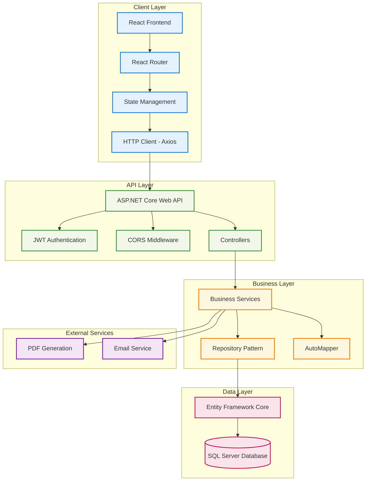

## Sơ Đồ Sequence - Đăng Nhập


## Sơ Đồ Sequence - Thêm Giao Dịch


## Sơ Đồ Sequence - Xem Dashboard

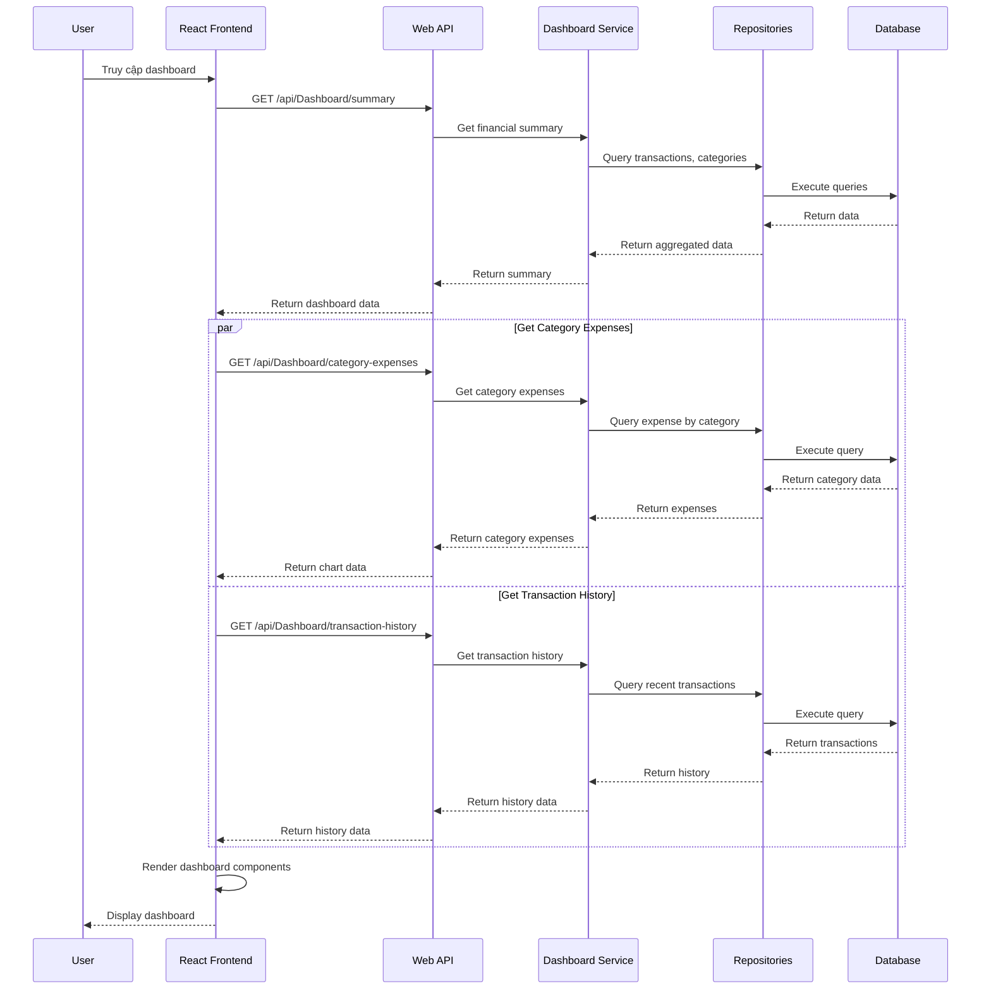

## Sơ Đồ Sequence - Quản Lý Ngân Sách

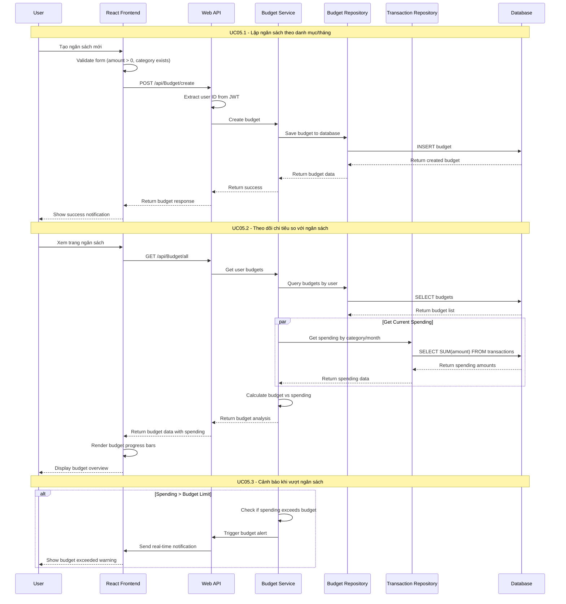

## Sơ Đồ Sequence - Quản Lý Mục Tiêu

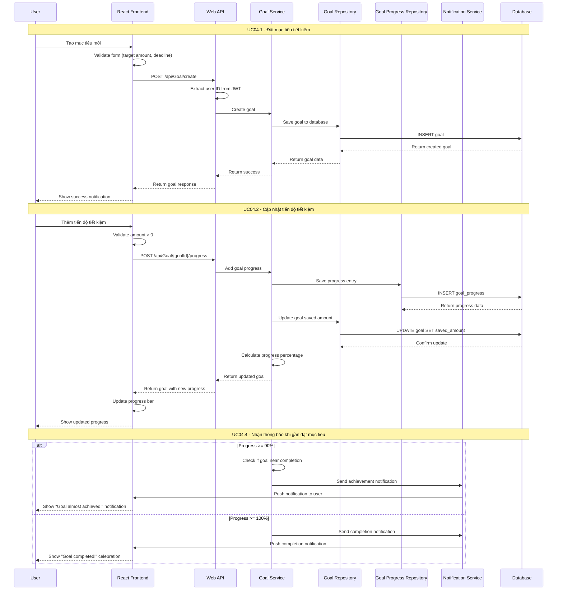

## Sơ Đồ Entity Relationship (ERD)

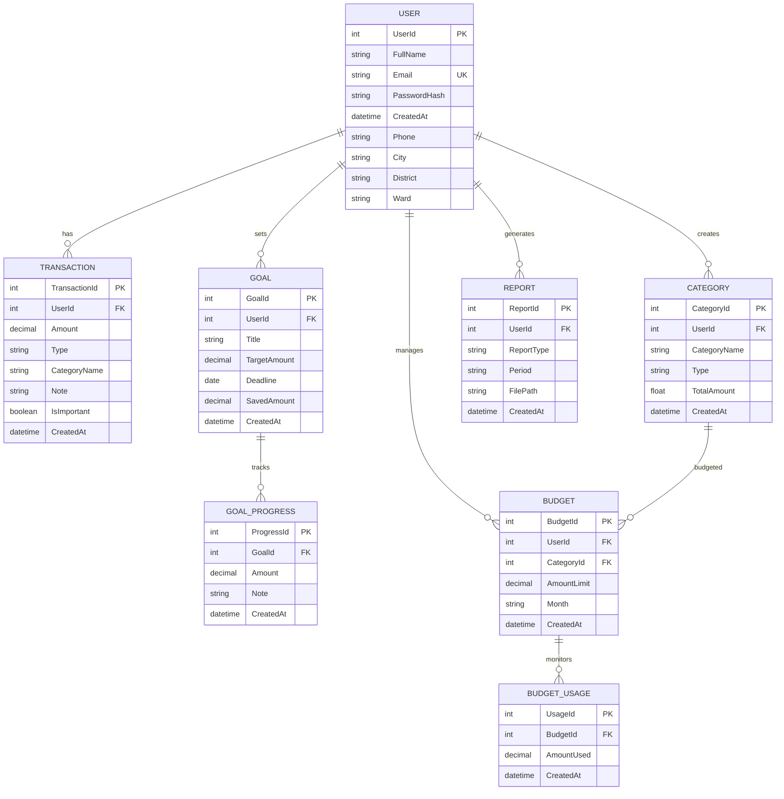

## Sơ Đồ Luồng Dữ Liệu (Data Flow)

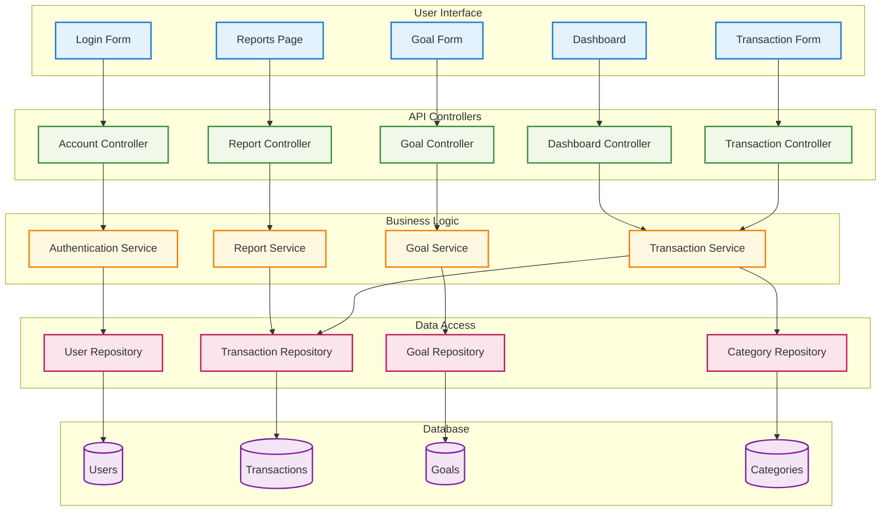

## Hướng Dẫn Cài Đặt và Chạy

### Yêu Cầu Hệ Thống
- **.NET 8 SDK** hoặc cao hơn
- **Node.js 18+** và **npm**
- **SQL Server** (LocalDB, Express, hoặc Full version)
- **Visual Studio 2022** hoặc **VS Code** (khuyến nghị)

### Cài Đặt Backend

```bash
# Clone repository
git clone <repository-url>
cd FinTrack

# Restore packages
cd FinTrack.Server
dotnet restore

# Update database connection string in appsettings.json
# Chạy migrations
dotnet ef database update

# Chạy server
dotnet run
```

### Cài Đặt Frontend

```bash
# Cài đặt dependencies
cd fintrack.client
npm install

# Chạy development server
npm run dev

# Build for production
npm run build
```

### Cấu Hình Database

1. **Tạo Database**: Tạo database mới trong SQL Server
2. **Connection String**: Cập nhật connection string trong `appsettings.json`
3. **Migrations**: Chạy `dotnet ef database update` để tạo tables
4. **Seed Data**: Thêm dữ liệu mẫu nếu cần

### Environment Variables

```bash
# Backend (.env hoặc appsettings.json)
ConnectionStrings__FinTrack="Server=...;Database=FinTrack;..."
JwtSettings__SecretKey="your-secret-key"
JwtSettings__Issuer="FinTrack"
JwtSettings__Audience="FinTrack-Users"

# Frontend (.env)
VITE_API_BASE_URL="https://localhost:7000/api"
```

## Lưu Ý Quan Trọng

### Bảo Mật
- ⚠️ **Không bao giờ** commit connection strings thật vào source control
- 🔐 Sử dụng **Environment Variables** cho production
- 🛡️ JWT Secret Key phải **mạnh và bảo mật**
- 🍪 Cookies được cấu hình **HttpOnly** và **Secure**

### Performance
- 📊 **Pagination** được implement cho danh sách giao dịch lớn
- 🗄️ **Caching** được sử dụng cho dashboard data
- 🔍 **Indexing** trên các trường thường xuyên query

### Backup & Recovery
- 💾 **Backup database** định kỳ
- 📁 **Backup file uploads** (reports, attachments)
- 🔄 **Test restore process** thường xuyên

### Monitoring
- 📈 **Application Insights** cho production monitoring
- 📝 **Structured logging** với Serilog
- 🚨 **Error tracking** và alerting

## Troubleshooting

### Lỗi Thường Gặp

1. **CORS Error**
   ```
   Giải pháp: Kiểm tra CORS policy trong Program.cs
   Đảm bảo frontend URL được thêm vào AllowedOrigins
   ```

2. **Database Connection Failed**
   ```
   Giải pháp: Kiểm tra connection string
   Đảm bảo SQL Server đang chạy
   Chạy dotnet ef database update
   ```

3. **JWT Token Invalid**
   ```
   Giải pháp: Kiểm tra JWT configuration
   Đảm bảo secret key đúng
   Kiểm tra token expiration
   ```

4. **Build Errors**
   ```
   Frontend: npm install, clear node_modules
   Backend: dotnet clean, dotnet restore
   ```

## Tính Năng Tương Lai

### Roadmap
- 📱 **Mobile App** (React Native)
- 🔔 **Push Notifications** cho mục tiêu và ngân sách
- 📊 **Advanced Analytics** với Machine Learning
- 💳 **Bank Integration** qua Open Banking API
- 🌍 **Multi-currency** support
- 👥 **Family/Shared** accounts
- 📸 **Receipt scanning** với OCR
- 🤖 **Chatbot** hỗ trợ tài chính

### Tích Hợp
- **Payment Gateways**: Stripe, PayPal
- **Banking APIs**: Plaid, Yodlee
- **Notification Services**: Firebase, SendGrid
- **Cloud Storage**: Azure Blob, AWS S3

---

*Tài liệu này được cập nhật thường xuyên. Vui lòng kiểm tra phiên bản mới nhất trên repository.*

**Liên hệ hỗ trợ**: support@fintrack.com
**Documentation**: https://docs.fintrack.com
**GitHub**: https://github.com/fintrack/fintrack

*Tài liệu này cung cấp hướng dẫn cơ bản để sử dụng FinTrack. Để biết thêm chi tiết kỹ thuật, vui lòng tham khảo source code và API documentation.*
